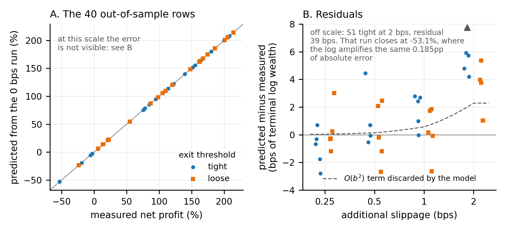
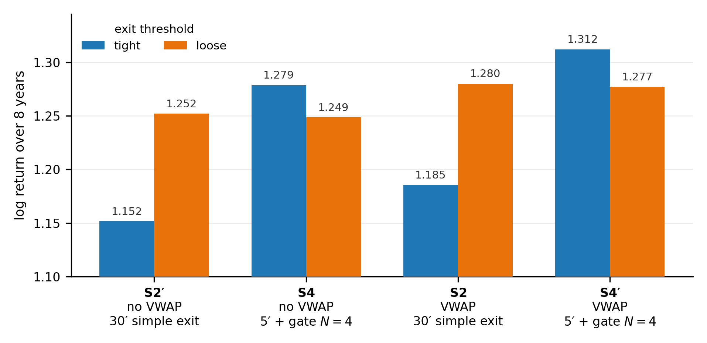
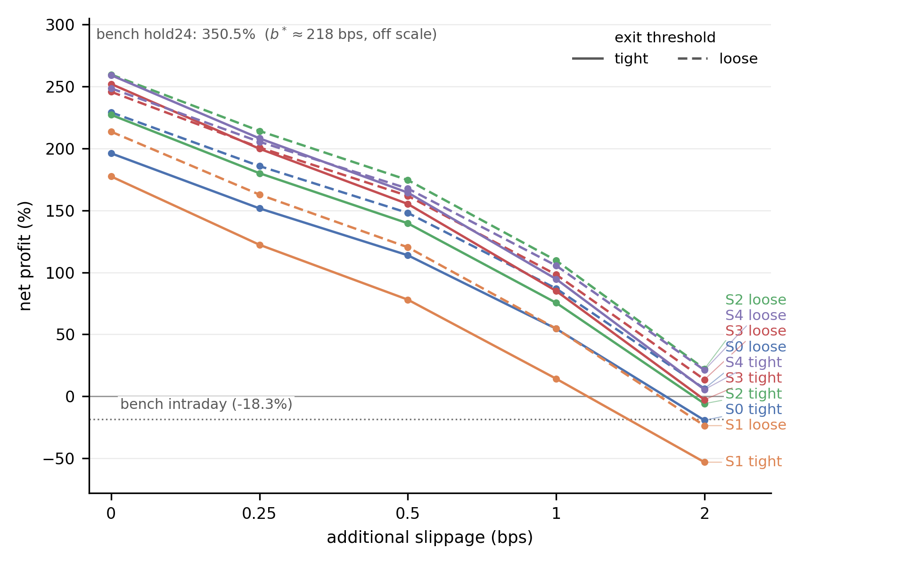

# Intraday momentum on SPY: an independent replication and cost analysis of `blackswan-quants/intraday-momentum`

# §0. Abstract

`blackswan-quants/intraday-momentum` implements five variants of an intraday momentum strategy on
SPY and presents them as a progression that culminates in Strategy 4, which the paper describes as
Pareto-dominant. This report re-runs the five published backtests, checks them against the
authors' own result files, adds fifty-three more, and reaches four conclusions.

First, there is a signal. A benchmark with no signal at all, on the same instrument, with the same
leverage rule and the same trading window, loses 36.1% over the period in which the strategy gains
271.4%, and it loses in both directions: 30.7% with the position reversed. Aligning the
benchmark's entry time with the strategy's own removes a further 17.8 points from the benchmark:
the opening half-hour, which the thirty-minute cadence excludes by construction, is worth that much
to a passive leveraged position in this sample. The edge is more sensitive to execution costs than
its size suggests, however. Reconstructing the effect of transaction costs in closed form from a
single backtest, the 271.4% falls to zero at 2.2 basis points of slippage per trade, while
leveraged buy-and-hold at the same leverage survives up to 218.

Second, the comparison on raw return is the less informative one. The strategy's 271% sits below
the 350% of leveraged buy-and-hold, but the gap is about the size of the margin interest that the
backtest does not charge, so it does not support an argument in either direction. The rest of the
comparison does hold: a beta of -0.05 and a quarter of the drawdown, 9.0% vs. 40.2%, because a
strategy that is flat every night does not touch an equity premium that, over this window, lives
almost entirely overnight.

Third, the persistence gate does not appear to be a standalone source of edge. It offsets a cost
that the five-minute exit check introduces, and the cell that separates the two effects was already
in the repository, in Strategy 1, although it had not been used for that purpose.

Fourth, the best of the fourteen configurations examined is not in the repository, but it is one
line away from Strategy 4 and its lead is small. Adding to Strategy 4 an entry condition that is
present in the code of Strategy 2 but absent from both published descriptions gives S4′, which
closes with 3.4% more capital over eight years, about 0.4% per year, on the strength of the 22 to
26 trades the condition blocks, at the price of a slightly deeper drawdown; whether that lead
survives outside this sample is not tested here. Corrected for selection across fourteen trials
with the Deflated Sharpe Ratio, S4′ remains distinguishable from search noise, although the test
is against a zero edge, not against Strategy 4. That check matters because the one significance
statistic the paper reports, QuantConnect's PSR, no longer reproduces on the platform today.

# §1. The repository and the paper

`blackswan-quants/intraday-momentum` is a QuantConnect/LEAN repository that implements five
variants (Strategy 0 to Strategy 4) of an intraday momentum strategy on SPY, backtested from
May 10, 2017 to May 10, 2025 (2,012 NYSE sessions) with an initial capital of 100,000 dollars.
The design is in the lineage of Zarattini, Aziz and Barbon (2024), which the paper acknowledges.
Every number in this report refers to that window. The common core, identical in all five, is a
breakout threshold recomputed every minute of the session: an upper band and a lower band derived
from the 14-day moving average of the absolute excursions from the open, and a vol-targeted
leverage

$$\Lambda = \min\!\left(2,\ \frac{0.02}{\sigma_{14g}}\right)$$

that sizes the exposure to target a daily portfolio volatility of 2%. Every position is forcibly
liquidated at 15:58 ET.

The five variants differ along three axes: whether entry requires only the band break or also
confirmation from a trend filter (a 100-period EMA and, in S2 only, the VWAP as well, a third
condition absent from both published descriptions; see §4.1); the cadence at which the exit is
checked, every 30 minutes or every 5; and whether the exit fires on the first violation or only
after the violation has persisted for $N=4$ consecutive checks. The paper presents them as a
progression: S1 speeds up the exit check, S2 adds the trend filter, S3 adds persistence, and S4
combines them all. It reads the decline from S0 to S1 (return from 196% to 177%, win rate from 40%
to 32%, with the Sharpe ratio almost unchanged) as what it calls the Momentum Paradox: a more
aggressive risk control, without a filter on noise, destroys the return it is meant to protect.
The comparison that closes the paper is instead between S4 and the two single-mechanism
configurations, S2 and S3 (Table 7): S4, at 259% with a Sharpe of 1.036, is presented as the
composition of the two mechanisms and described as Pareto-dominant.

This reading rests on an implicit assumption: that each row of the table isolates a single change
relative to the row before it. §4 shows that this assumption does not hold. S2 and S4, the
comparison on which the paper builds its final conclusion, differ on **two** axes at once, not
one; and cadence and persistence, introduced together in the step from S0/S2 to S3/S4, turn out to
be separable in the available data, which is not what the design suggests at first sight.

It also rests on a point of comparison. The paper adopts only one: SPY bought and held, which over
the window returns 166.4% with a Sharpe of 0.47 and a drawdown of 33.7%, and which S0 exceeds
with its 196% (paper, §3.2). The comparison is between a leveraged strategy, whose
leverage rule averages 1.81, and a benchmark at leverage 1. That is the point from which §2 starts.

Before going into the substance, we run an elementary check against the strongest source
available: not the rounded table in the README but `stats/strat{0..4}_8y.json`, the authors' own
backtest output, preserved in the repository.

### T1. The five published backtests: authors' result files vs. reproduced today (`tight` variant, 0 bps)

| | source | return | Sharpe | drawdown | win rate | orders | PSR | turnover |
|:-----|:--------------|--------------:|----------:|------------:|-----------:|---------:|-------------:|-------------:|
| S0 | authors | 196.232% | 0.835 | 11.2% | 40% | 3594 | 61.589% | 222.35% |
| | reproduced | **196.125%** | **0.835** | **11.2%** | **40%** | **3594** | **21.510%** | **222.36%** |
| S1 | authors | 177.757% | 0.842 | 10.1% | 32% | 4900 | 67.736% | 303.52% |
| | reproduced | **177.468%** | **0.841** | **10.1%** | **32%** | **4900** | **21.982%** | **303.52%** |
| S2 | authors | 227.320% | 0.948 | 8.7% | 40% | 3450 | 75.319% | 213.01% |
| | reproduced | **227.196%** | **0.947** | **8.7%** | **40%** | **3450** | **33.461%** | **213.01%** |
| S3 | authors | 252.248% | 1.012 | 9.3% | 40% | 3550 | 81.164% | 219.91% |
| | reproduced | **252.101%** | **1.011** | **9.3%** | **40%** | **3550** | **41.219%** | **219.91%** |
| S4 | authors | 259.235% | 1.036 | 8.4% | 40% | 3388 | 83.439% | 209.40% |
| | reproduced | **259.177%** | **1.036** | **8.4%** | **40%** | **3388** | **44.342%** | **209.40%** |

Authors: `stats/strat{s}_8y.json`, the backtest output preserved in the repository. Reproduced: the same code re-run today. Orders, Sharpe, drawdown, win rate and turnover agree within rounding on all five rows; the PSR differs by 39.1 to 45.8 points (41.3 on average). See §1 and §7.

Orders, drawdown and win rate match exactly on all five rows; Sharpe matches to within a
thousandth, turnover to within a hundredth of a point. Return matches to within 0.29 percentage
points (pp) in the worst case (S1) and 0.06pp in the best (S4), always on the low side, and the
gap has an identifiable cause: the commissions of the new runs are higher by between 0.24% and
0.51% **at exactly the same order count**, so the difference lies in the fill prices, not in the
strategy. The code in the repository does today what it did for the authors.

**One exception, and only one**: the Probabilistic Sharpe Ratio does not reproduce on any of the
five rows, with a gap of between 39.1 and 45.8 percentage points, 41.3 on average. This is not a
code reproducibility problem, and it is not something the authors could have controlled: it is a
platform statistic that has not remained stable over time. The discussion is
in §7 and in Appendix A, where it becomes the reason for computing the Deflated Sharpe Ratio from
the raw moments rather than citing it.

Beyond that, the issue this report takes up is not the reproducibility of the numbers. It is what
those numbers allow one to conclude, and that is the question the sections that follow answer.

## 1.1 Conventions and units

Three different quantities appear in what follows, and they are fixed here, because confusing
them changes the conclusions by a factor of three.

**Return.** Unless otherwise stated, "return" is the cumulative return over the full eight-year
window, net of commissions, as QuantConnect reports it: the 196.125% of S0 means that 100,000
dollars become 296,125.

**Log return.** When *effects* are compared (how much an entry condition is worth, how much a
cadence costs), the metric is $\ln(1+R)$, and differences between cells are differences of
logarithms. A value of $-0.06508$ means that final wealth is $e^{-0.06508} = 93.7\%$ of the
reference's, that is, 6.3% less; on cumulative return the same gap is worth 18.7 percentage
points, because the return is compounded over eight years. The two readings must not be mixed.

The choice of the logarithm is not cosmetic. The cells of the design start from different levels,
196% under `tight` and 229% under `loose`, and only a proportional measure makes them comparable.
Above all, the factorial design of §4 rests on tests of the form "the interaction is zero,
therefore the two effects are additive": if two independent effects multiply wealth by $(1+a)$ and
$(1+b)$, in percentage points the combined effect is $a+b+ab$, and a spurious interaction equal to
the product would appear; with the values at stake, about ten times the one actually measured. In
logarithms, independent effects add by construction, so an interaction that is zero to the fourth
decimal place means something.

**Basis points (bps) of terminal log wealth.** In §3 the residuals of the cost model are measured
in this unit: 1 bps is 0.01% of the final multiplier. It is needed because the same error in
percentage points weighs differently on a run that closes at $+250\%$ and on one that closes at
$-53\%$, so in percentage points the residuals would not be comparable across rows.

**Costs.** The horizontal axis of every cost chart and cost table is the **additional** slippage:
the 0 bps level is not a backtest without costs, it is a backtest that pays Interactive Brokers
commissions in full and nothing else. The risk-free rate is set at $r_f = 2\%$ and the margin
financing rate at 3.5%, both conventions declared in advance and discussed where they are used.

# §2. What the strategy is measured against

A return of 271% over eight years means nothing until one says what it is measured against. The
paper does adopt a point of comparison, SPY bought and held at 166.4%, but without leverage, while
the strategy runs at an average leverage of 1.81: the comparison is between a leveraged portfolio
and one that is not. The Sharpe ratio attached to that benchmark, 0.47, also does not follow from
the numbers reported with it: 166.4% over eight years is 13.0% per year, which with the 16%
volatility stated on the same line gives 0.69. The quoted value appears to be the long-run
historical figure for equities rather than the one for this window, so the "nearly double" that
the paper states for the Sharpe of S0 corresponds to a factor of about 1.2 rather than 1.8. This
section builds two benchmarks in its place, each designed to isolate one thing, before going into
the construction itself. They are what determines which questions are worth asking afterwards.

Both benchmarks share the strategy's leverage rule, $\Lambda = \min(2,\ 0.02/\sigma_{14g})$, and
differ only in what they are meant to isolate. Leverage is matched because it is a free parameter
that anyone can raise: comparing a portfolio at leverage 1.81 with one at leverage 1 measures the
signal and the decision to take more risk together, and does not separate the two. And the whole
rule is matched, not just the average multiplier, because the rule has effects of its own on
compounded return. Further below we measure that volatility targeting costs 9% less than a fixed
leverage of the same mean, and that advantage belongs to the null hypothesis, not to the signal.

One thing about that rule changes how it needs to be understood. On this window and with the repository's
parameters, $\Lambda$ is **at the cap of 2 on 66.1% of days**, with an average of 1.8056: for two
thirds of the time there is no targeting at all, only fixed leverage at the maximum allowed. The
figure comes from the instrumented benchmark, which replicates the rule without a signal, but it
does not depend on the benchmark: the average weight per fill of the fourteen strategy
configurations, $\bar w \in [1.805;\ 1.828]$ in §3.7, is the same average leverage read off their
own orders. The cap is not incidental: the paper's own §2.3 mentions the insufficient buying power
errors that motivated it.

The first benchmark, `intraday`, is long SPY from 9:31 to 15:58 and closes every evening, with no
signal at all: it is the strategy stripped of nothing but its entry and exit logic. The second,
`hold24`, keeps the position overnight as well: it is leveraged buy-and-hold, that is, the
alternative an investor actually has available. Both are needed because they answer two different
questions and neither is sufficient on its own. `hold24` says whether it would have been better to
do something else, but it differs from the strategy on three axes at once (trading window,
direction selection, entry timing) and therefore cannot attribute anything to the signal.
`intraday` differs on one axis only, the presence of the signal, and is therefore the only one of
the two that isolates it.

### T2. The two full-session benchmarks (entry at 9:31) vs. the best configuration

|  | intraday (9:31 to 15:58) | hold24 | S4′ tight |
|:---|---:|---:|---:|
| net profit | -18.31% | 350.52% | 271.37% |
| CAR | -2.50% | 20.70% | 17.82% |
| Sharpe (QC) | -0.154 | 0.615 | 1.075 |
| drawdown | 40.5% | 40.2% | 9.0% |
| recovery (days) | 147 | 714 | 343 |
| β | 0.800 | 1.323 | -0.053 |
| α | -0.089 | 0.043 | 0.101 |
| PSR | 0.004% | 6.915% | 49.490% |
| orders | 3,997 | 1,587 | 3,336 |
| commissions (USD) | 9,746.60 | 1,604.39 | 15,708.03 |
| $w_{sum}$ | 7,171.26 | 68.89 | 6,024.57 |
| $b^*$ (bps) | -0.282 | 218.486 | 2.178 |

## There is a signal

The full-session benchmark, the one entering at 9:31 and reported in T2, loses 18.31%, with a
Sharpe of $-0.154$ and a drawdown of 40.5%. Matched to the strategy's entry time it loses far more,
but the point already holds in this form.

This is the most important result of the section: before this run,
none of the 54 backtests collected up to that point excluded the possibility that
the strategy's return came simply from being long intraday at leverage 1.8.

Instrument and leverage rule are identical; the trading window is not, and the difference was
measured rather than argued. The benchmark enters at 9:31, while the strategy cannot enter before
10:00: the thirty-minute cadence places the first usable evaluation there, as the paper itself
notes in a footnote. Repeating the run with entry at 10:00 and nothing else changed, the matched
benchmark closes at **$-36.08\%$**, not at $-18.31\%$. That it is the same experiment with one
variable moved is confirmed by the controls: `lambda_avg` $= 1.8056$ and `pct_capped` $= 66.1\%$
identical to the last digit, $w_{sum}$ within 0.02%, turnover within 0.01%, order count within
four out of four thousand.

The timing difference was therefore worth 17.8 points, and in the opposite direction to the one
expected on paper: the half-hour between 9:31 and 10:00 works in favor of whoever holds it, and
letting the benchmark keep it was **helping** the benchmark, not penalizing it. The correctly
matched comparison, same window as the strategy, same leverage, no signal, puts $+271.37\%$
vs. the $-36.08\%$ of the long null and the $-30.75\%$ of the short null (next paragraph):
**between 302 and 307 points depending on the direction in which the null hypothesis is held**,
vs. the 289.7 of the unmatched comparison. The number to cite is the narrower of the two,
302.1, because the strategy trades in both directions and the null should be taken in its most
generous version. This is also a first observation about the design of the repository, not only a
methodological qualification: the thirty-minute entry cadence excludes the opening half-hour by
construction, and in this sample that half-hour contributes positively while the rest of the
session does not, and it is worth 17.8 points to a passive leveraged position.

### T3. The benchmark matched on entry time (10:00, as the strategy)

Same script, same leverage rule, one variable changed: the entry minute, and for the third column the sign of the position.

| | entry 9:31, long | entry 10:00, long | entry 10:00, short |
|:---------------------------|-----------------------:|-------------------------:|--------------------------:|
| net profit | -18.31% | -36.08% | -30.75% |
| Sharpe (QC) | -0.154 | -0.299 | -0.260 |
| drawdown | 40.5% | 49.0% | 46.4% |
| $\beta$ | 0.800 | 0.724 | -0.724 |
| $\alpha$ | -0.089 | -0.106 | 0.011 |
| avg win / avg loss | 0.93% / -1.06% | 0.83% / -0.99% | 0.99% / -0.83% |
| orders | 3,997 | 4,001 | 4,004 |
| commissions (USD) | 9,746.60 | 8,869.29 | 9,799.29 |
| `ann_std` | 0.182 | 0.170 | 0.170 |
| $w_{sum}$ | 7,171.26 | 7,170.04 | 7,171.86 |
| turnover | 245.45% | 245.42% | 245.45% |
| `lambda_avg` | 1.8056 | 1.8056 | 1.8056 |
| `pct_capped` | 66.1% | 66.1% | 66.1% |

Controls: `lambda_avg` and `pct_capped` identical to the last digit on all three runs (same leverage path), $w_{sum}$ within 0.03%, $w_{sum}/(\text{turn}/100) \in [2,921.5;\ 2,921.9]$ vs. the 2,922 calendar days. The long and the short at 10:00 are mirror images in $\beta$ ($\pm 0.724$) and have average win and average loss swapped: they are the same exposure in the two directions.

A natural objection is that the benchmark is long-only while the strategy also goes short, so the
comparison is not matched on exposure. This too was measured rather than estimated: the same
benchmark, same 10:00 to 15:58 window, with only the sign of the position reversed, closes at
**$-30.75\%$**. It is the exact mirror of the long run, with $\beta = -0.724$ vs. $+0.724$ and
average win and average loss swapped digit for digit (0.99% / $-0.83\%$ vs. 0.83% /
$-0.99\%$), so the two rows measure the same exposure in the two directions.

**Blind exposure loses in both directions**, and the gap between the two is 5.3 points over eight
years. That, and only that, is the drift term of the window; the rest, more than thirty points and
common to both, is variance drag and commissions, which depend on $\Lambda^2$ and on the number of
fills and do not distinguish the sign of the position. The asymmetry exists and favors the short
side, not the long side as one would have expected, but it is an order of magnitude too small to
make either direction a sensible choice. There is no right side to be on without a signal: it is
the cost of *being there*, not the direction, that determines the outcome.

On the opposite side, the trade files published in the repository rule out the possibility that
the edge lives on the short side: on S4 the 878 long trades produce 137,578 dollars and the 816
short trades 137,500, that is, 50.0% and 50.0% of the P&L, and the split is close to even on S2
and S3 as well (49.6% and 48.8% long).
The P&L is in dollars not rescaled by the equity of the moment, but the two directions are
interleaved in time, so the imbalance favors neither. It is the same fact that can be read in
$\beta = -0.053$: if the strategy were predominantly long, its beta would be a positive fraction of
the intraday benchmark's 0.800.

## Why the intraday benchmark loses

Not because SPY falls: over the same window `hold24` makes $+350.5\%$. It loses because of two
mechanical effects, both independent of the direction of the market. The decomposition that
follows is that of the full-session run, entering at 9:31, the only one of the three instrumented
with the accumulators, and its items should be understood relative to that $-18.31\%$, not to the
matched $-36.08\%$: the mechanism is the same, the magnitudes are not.

Both effects are measured, not estimated. The obvious route, deriving them from the statistics
LEAN reports, would make them inherit LEAN's conventions, and Appendix A, §A.8 shows that at least
one of those conventions is not the one a reader would assume. They are therefore collected inside
the backtest: a single run at 0 bps, with four scalar accumulators updated at every session close
and emitted via `set_runtime_statistic`, the only channel on the Free plan that does not consume
the log quota. The number of samples comes back as 2,012, exactly the independent count of NYSE
sessions in the window, a free check that the sampling is one point per session with no gaps.

**Commissions: 9,746.60 dollars** on an account that starts at 100,000 and closes at 81,691, with
3,997 orders over eight years. The right denominator is not the initial capital. The Interactive
Brokers fee model is per share, and the shares in a trade are worth $\Lambda E/P$: the commission
per trade is $c\,\Lambda E/P$, and relative to equity it is $c\,\Lambda/P$, a quantity that does
not depend on the size of the account. Total commissions are then proportional to the **integral
of equity over time**, not to the starting capital, and dividing by 100,000 would overstate the
rate, because the account shrank over the whole window. With an average equity of 87,027 over the
2,012 sessions the integral is $\int_0^8 E_t\,dt = 696{,}215$, and the result is

$$\phi = \frac{\text{commissions}}{\text{years}\cdot\bar E} = \frac{9{,}746.59}{8 \cdot 87{,}027} = 1.400\%\ \text{per year}$$

**Leverage drag.** Holding $\Lambda$ times the exposure does not multiply the compounded return by
$\Lambda$. Over a single session the log return of the leveraged position is
$\ln(1+\Lambda r) \approx \Lambda r - \tfrac12\Lambda^2r^2$, while $\Lambda$ times the log return
of the underlying is $\Lambda r - \tfrac12\Lambda r^2$: the difference, what leverage costs
**beyond** simple rescaling, is $\tfrac12\Lambda(\Lambda-1)r^2$. Since the portfolio return is
$r_{port} = \Lambda r$, the same quantity can be written with the portfolio series alone:

$$\tfrac12\,\Lambda_t(\Lambda_t-1)\,r_t^2 \;=\; \tfrac12\,\frac{\Lambda_t-1}{\Lambda_t}\,r_{port,t}^2$$

and this is the form accumulated session by session inside the run. The sum built this way never
passes through `ann_std`, so it does not inherit LEAN's annualization convention (Appendix A,
§A.8). Divided by the number of years, it is 0.969% per year.

**The arithmetic.** The two drags are logarithmic and add to each other, so they must be compared
with the log CAR, $-\ln(1+R)/8 = 2.528\%$, and not with the simple CAR; mixing the two scales is
worth a few tenths of a point:

$$1.400\% + 0.969\% = 2.369\% \qquad \text{vs.} \qquad 2.528\%$$

### T4. Decomposition of the `intraday` benchmark's return (entry at 9:31, 0 bps)

| item | how it is obtained | value |
|:----------------------------------------|:-----------------------------------------|:-------------------|
| commissions | $\phi = \text{fees}/(\text{years}\cdot\bar E)$ | 1.400%/year |
| leverage drag | $\tfrac{1}{2}\sum_t \frac{\Lambda_t-1}{\Lambda_t}r_{port,t}^2 \big/ \text{years}$ | 0.969%/year |
| **sum of the two mechanical effects** | | **2.369%/year** |
| measured log CAR | $-\ln(1+R)/\text{years}$ | 2.528%/year |
| **residual, leveraged position** | | **-0.159%/year** |
| residual, underlying | residual$/\bar\Lambda$ | -0.088%/year |

Raw values from the instrumented run (Runtime Statistics, not recomputable from a CSV, since the Free plan offers no API access): `eq_n` = 2012, `avg_equity` = 87026.93, `drag_sum` = 1.550661e-01, `total_fees` = 9746.59. The `eq_n` count coincides with the NYSE sessions counted separately in the window: an independent check that the sampling is one point per session, with no gaps.

The two mechanical effects therefore explain 94% of the loss, and the residual is $-0.159\%$ per
year on the leveraged position, that is, $-0.088\%$ per year on the underlying.

> The second figure divides the first by $\bar\Lambda$, which treats leverage as a constant. It
> is not one: $\Lambda_t$ is set from the trailing volatility of the same series whose returns it
> multiplies, so the exact conversion carries a covariance term that the division drops,
> $E[\Lambda_t x_t]/\bar\Lambda = E[x_t] + \operatorname{Cov}(\Lambda_t, x_t)/\bar\Lambda$. That
> the two are not independent is measured two paragraphs below, on the second moment: cutting
> $\Lambda_t$ exactly when $r_t^2$ is large is what makes the drag 9% lower than at a constant
> leverage of the same mean. The $-0.088\%$ is therefore the order of magnitude of the unleveraged
> residual, not an identity, and nothing in the section rests on its second digit.

That residual is the **compounded** return of a passive, unleveraged intraday position: it says
that anyone long from 9:31 to 15:58 for eight years, without leverage and without costs, would
have ended flat to within a tenth of a point per year. It does not say that the arithmetic daily
mean is zero; that mean is positive, and it is consumed by its own variance drag until the
compounded return reaches zero. The distinction matters because the session is not homogeneous:
"SPY does not drift intraday" does not hold segment by segment; "a passive position over the
whole session ends flat" is what was measured. The return SPY actually delivered
over the window, 166.4% (paper, §3.2), that is, 13.0% per year, therefore lives almost entirely
overnight, the segment this comparison does not measure; that the equity premium of US stocks
accrues overnight rather than during trading hours is documented well beyond this window (Cooper,
Cliff and Gulen, 2008; Lou, Polk and Skouras, 2019).

One last observation on the drag, which is a fact about the sizing rule and not about the
benchmark. At constant leverage, with $\bar\Lambda = 1.8056$, the formula would give 1.07% per
year; measured, it gives 0.969%, 9% less. The difference is the leverage rule at work: $\Lambda_t$
is cut precisely on the days when $r_t^2$ is large, and the drag weights the squares. **Volatility
targeting costs less than a fixed leverage of the same mean**, and the margin is measurable.

From this follows the property that makes the strategy interesting. A strategy that goes flat
every evening does not touch the equity premium by construction, and indeed it has
$\beta = -0.053$. It does not participate in the market: it extracts return from a window whose
compounded return is zero. The zero beta is not the result of an optimization; it is a consequence
of the schedule. The schedule has five exceptions in eight years, all on half-day sessions where
the 15:58 liquidation branch is never reached (§7, item 3); §8 bounds what they are worth.

## The opportunity cost

The uncomfortable question remains. `hold24` makes $+350.5\%$ vs. $+271.4\%$, and it is almost
immune to costs: its break-even is at 218 bps of slippage vs. the strategy's 2.2, because
`set_holdings` rebalances only the delta and the notional traded is therefore two orders of
magnitude smaller. Under any cost assumption the gap widens rather than closes.

One correction, however, works in the opposite direction. LEAN does not charge interest on the
borrowed balance, and with $\Lambda_{avg} = 1.8056$ `hold24` stays borrowed for 0.8056 units of
equity every night for eight years. The correction is subtractive on the CAR, because interest
accrues on the balance at the start of the period and not on the realized return:
$E_{t+1} = E_t\,(1 + g - (\Lambda-1)r)$.

### T5. Correction for the financing that LEAN does not charge (hold24, gross CAR 20.702%)

| $r$ | annual cost | hold24 corrected |
|---:|---:|---:|
| 2.0% | 1.61% | 304.6% |
| 2.5% | 2.01% | 293.8% |
| 3.0% | 2.42% | 283.2% |
| **3.5%** | **2.82%** | **272.9%** |
| 4.0% | 3.22% | 262.8% |
| 4.5% | 3.63% | 253.0% |
| 5.0% | 4.03% | 243.4% |

Subtractive form, borrowed balance $(\Lambda-1) = 0.8056$. At the chosen rate (3.5%) hold24 makes 272.9% vs. 271.4% for S4′ tight. **Break-even rate: 3.58%.**

At the declared convention, $r = 3.5\%$ (average T-bill rate over the window plus a retail-account
spread), `hold24` makes 272.9% vs. 271.4%. The rate at which the two break even is 3.58%, that
is, inside the range the sensitivity table covers.

The asymmetry deserves stating, otherwise the correction looks chosen for convenience: it hits
`hold24` in full and barely touches the strategy, because brokers charge interest on the overnight
balance and the strategy is flat every evening.

But the conclusion that holds is not that the strategy wins. It is that the return gap between the
two is of the same order as the uncertainty on the one cost item the backtest does not charge, and
therefore does not support an argument in either direction.

## What remains

The comparison that holds is the other one, and it does not depend on $r$. Same instrument, same
window, same leverage rule: drawdown 9.0% vs. 40.2%, $\beta = -0.053$ vs. 1.323,
$\alpha = +0.101$ vs. $+0.043$, PSR 49.5% vs. 6.9%. Recovery from the maximum drawdown
takes 343 days vs. 714. The two PSRs are measured in the same session and on the same version
of the platform, so they are comparable with each other; §7 explains why they should not be
compared with the published ones.

The defensible formulation is therefore this: it is not a better way of earning from the market,
it is a source of return almost orthogonal to the market at a quarter of the drawdown. "271
vs. 350" is the less informative comparison, and the columns that show it are above.

The rest of the report answers a different question, one that only makes sense after this one:
given that this is a zero-beta diversifier, is it well built?

# §3. Method: one backtest, every cost level

**With this code architecture, a single instrumented backtest at 0 bps contains every cost level
in closed form.**

The question is not invented for the occasion: the paper raises it itself. Among the lines of
future work listed in §6.7 is "re-running with 2× and 5× baseline transaction costs to establish
the break-even cost level". What follows answers that question for every cost level rather than for
two, and without re-running anything.

## 3.1 The two invariances everything depends on

In an arbitrary backtest, introducing costs changes the history: the capital available at each
instant is different, and if decisions depend on capital or on execution prices, then *which*
trades occur changes as well. When that happens there is no closed form: every cost level is a
different experiment and has to be re-run.

The repository's code has two properties that break that circle.

The first: **the signal does not look at execution prices**. Entries and exits in all five
strategies evaluate `data[symbol].close`, that is, the market price of the bar, not the price at
which our order was filled. Slippage moves the second and leaves the first intact, so it does not
touch the condition that decides whether to open or close.

The second: **sizing is relative to equity**. `set_holdings` receives a fraction of net equity,
$\Lambda_t$, not a number of shares. A smaller account buys proportionally fewer shares, but the
position remains the same fraction of capital.

It follows that the set of trade instants $T = \{t_1,\dots,t_N\}$, the direction of each, and the
weight of each as a fraction of equity are **identical at every cost level**. What changes is how
much is subtracted at each fill, not which fills occur. This is a property of the code, not of the
data, and it is falsifiable: a stop-loss anchored to the fill price, or sizing by a fixed number of
shares, would be enough to break it. The constant order count across the five cost levels, in all
ten combinations, is the check that it does not break here.

## 3.2 The equity curve at cost $b$

Let $E_0(t)$ be the equity path in the 0 bps run. For the $i$-th fill, executed at $t_i$, let
$Q_i$ be the number of shares, $P_i$ the market price and $V_i$ the equity immediately before the
order. The **execution weight** is the notional traded as a fraction of equity:

$$w_i = \frac{|Q_i P_i|}{V_i}$$

With an additional slippage of $b$ basis points ($1\ \text{bps} = 10^{-4}$), the fill loses a
fraction $w_i\,b/10^4$ of equity. Since the effect is multiplicative and compounds fill after fill:

$$E_b(t) = E_0(t)\cdot \prod_{i:\,t_i \le t}\left(1 - \frac{w_i\, b}{10^4}\right)$$

Under the two invariances of §3.1 this is not an approximation: it is an identity, because the
product runs over exactly the same fills with exactly the same weights.

## 3.3 First order and break-even

Moving to the cumulative return $1 + R_b = E_b(T)/E(0)$ and taking the logarithm, the product
becomes a sum:

$$\ln(1+R_b) = \ln(1+R_0) + \sum_{i=1}^{N}\ln\!\left(1 - \frac{w_i b}{10^4}\right)$$

The cost per single fill is of order $10^{-4}$, so the expansion $\ln(1-x) = -x + O(x^2)$ is
extremely accurate term by term:

$$\ln(1+R_b) = \ln(1+R_0) - \frac{b}{10^4}\,w_{sum} + O(b^2), \qquad w_{sum} = \sum_{i=1}^{N} w_i$$

The log return is **affine in $b$**, with slope $-w_{sum}/10^4$. A single quantity accumulated
during the run, $w_{sum}$, describes the entire cost map. Setting the return to zero gives the
break-even level:

$$b^* = \frac{10^4\,\ln(1+R_0)}{w_{sum}}$$

The neglected term is $-\tfrac{b^2}{2\cdot 10^8}\sum_i w_i^2$. The sum of squares is not
observable from the data collected; $w_{sum}^2/N$ is a lower bound for it by Cauchy-Schwarz, with
equality if all weights were identical. It is used further on to verify that the residual grows
where it should.

## 3.4 Where the commissions are

The model reconstructs **slippage**. Commissions are not modeled at all: they are already inside
$E_0$, because the 0 bps run is not a run without costs but a run without *additional* slippage,
one that pays the Interactive Brokers fee model in full. The horizontal axis of every chart is
therefore "additional slippage", not "total cost".

For this to work only one thing is needed: that the commission, **as a fraction of equity**, be
the same at every level of $b$ for the same trade. The fee model is per share, with a rate of
$c = 0.005$ per share, and the quantity of an order is $|Q_i| = \Lambda_i V_i / P_i$. Therefore

$$\frac{\text{Fee}_i}{V_i} = c\,\frac{\Lambda_i}{P_i}$$

and both $\Lambda_i$ (which comes from SPY's 14-day volatility, a market quantity) and $P_i$ are
**invariant in $b$**. The commission takes the same fraction of equity at every cost level: it
multiplies every path by the same sequence of factors, and cancels in the ratio $E_b/E_0$. This
does not require the fraction to be constant *over time*, and it is not: it goes as $1/P_i$, so
over the sample it halves while SPY moves from about 240 to about 570 dollars. What the model
needs is that the fraction be the same in the two runs **at the same instant**, and it is, because
at that instant both see the same price and the same leverage. On the order of magnitude, half a cent
per share is equivalent to a tenth to a fifth of a basis point of slippage, a fraction of what is
being measured on the cost axis.

That commissions do follow equity can be seen in the raw data. Between the S0 `tight` run at 0 bps
and the one at 1 bps, commissions paid go from 15,460 to 11,230 dollars, that is, to 73%, at
exactly the same 3,594 orders; final equity instead falls to 52%. They are neither fixed nor
proportional to the final result: they follow equity along the whole path, higher at the start and
lower at the end. The real check, however, is the out-of-sample validation of §3.6, whose forty
predicted returns are all net of commissions: if commissions did not follow equity, the smaller
account at high $b$ would pay a larger fraction of them, and the model would overstate returns by
an amount increasing in $b$. It does not.

## 3.5 The per-order minimum

The declared fee model also has a minimum of 1 dollar per order, and a fixed minimum is not
proportional to equity. That is not the regime in operation: the average order pays between 3.98
and 4.77 dollars across all fourteen configurations, four to five times the threshold, and not
even the most penalized run gets there, since S1 `tight` at 2 bps closes at $-53\%$ and still pays
1.87 dollars per order. Where the minimum could bite, on the most de-leveraged days, it would make
commissions slightly *more* than proportional: the error is bounded and of known sign. The one run
that sits entirely inside the minimum is `hold24`, at 1.011 dollars per order, because it
rebalances only the delta and its orders are two orders of magnitude smaller: one more reason,
independent of those in §2, why its cost structure is not comparable with that of the strategies.

## 3.6 Out-of-sample validation

Forty rows, the four at $b>0$ for each of the ten strategy/threshold combinations, none of them
used to calibrate the model, which starts only from the 0 bps run of each combination.

### T6. Out-of-sample validation of the cost reconstruction

|  | exit threshold | bps | measured | predicted | error (pp) |
|:---|:---|---:|---:|---:|---:|
| S0 | `tight` | 0.25 | 151.688 | 151.706 | +0.018 |
| S0 | `tight` | 0.50 | 113.854 | 113.949 | +0.095 |
| S0 | `tight` | 1.00 | 54.578 | 54.578 | -0.000 |
| S0 | `tight` | 2.00 | -19.349 | -19.310 | +0.039 |
| S0 | `loose` | 0.25 | 185.827 | 185.793 | -0.034 |
| S0 | `loose` | 0.50 | 148.064 | 148.115 | +0.051 |
| S0 | `loose` | 1.00 | 87.004 | 87.007 | +0.003 |
| S0 | `loose` | 2.00 | 6.195 | 6.235 | +0.040 |
| S1 | `tight` | 0.25 | 122.325 | 122.263 | -0.062 |
| S1 | `tight` | 0.50 | 78.042 | 78.041 | -0.001 |
| S1 | `tight` | 1.00 | 14.231 | 14.242 | +0.011 |
| S1 | `tight` | 2.00 | -53.148 | -52.963 | +0.185 |
| S1 | `loose` | 0.25 | 162.825 | 162.831 | +0.006 |
| S1 | `loose` | 0.50 | 120.309 | 120.283 | -0.026 |
| S1 | `loose` | 1.00 | 54.707 | 54.734 | +0.027 |
| S1 | `loose` | 2.00 | -23.660 | -23.652 | +0.008 |
| S2 | `tight` | 0.25 | 180.068 | 180.019 | -0.049 |
| S2 | `tight` | 0.50 | 139.657 | 139.644 | -0.013 |
| S2 | `tight` | 1.00 | 75.472 | 75.519 | +0.047 |
| S2 | `tight` | 2.00 | -5.885 | -5.845 | +0.040 |
| S2 | `loose` | 0.25 | 214.209 | 214.304 | +0.095 |
| S2 | `loose` | 0.50 | 174.561 | 174.629 | +0.068 |
| S2 | `loose` | 1.00 | 109.633 | 109.672 | +0.039 |
| S2 | `loose` | 2.00 | 22.150 | 22.216 | +0.066 |
| S3 | `tight` | 0.25 | 199.832 | 199.812 | -0.020 |
| S3 | `tight` | 0.50 | 155.270 | 155.288 | +0.018 |
| S3 | `tight` | 1.00 | 85.043 | 85.095 | +0.052 |
| S3 | `tight` | 2.00 | -2.754 | -2.698 | +0.056 |
| S3 | `loose` | 0.25 | 200.875 | 200.867 | -0.008 |
| S3 | `loose` | 0.50 | 161.786 | 161.781 | -0.005 |
| S3 | `loose` | 1.00 | 98.235 | 98.183 | -0.052 |
| S3 | `loose` | 2.00 | 13.540 | 13.585 | +0.045 |
| S4 | `tight` | 0.25 | 208.207 | 208.197 | -0.010 |
| S4 | `tight` | 0.50 | 164.435 | 164.454 | +0.019 |
| S4 | `tight` | 1.00 | 94.664 | 94.711 | +0.047 |
| S4 | `tight` | 2.00 | 5.491 | 5.553 | +0.062 |
| S4 | `loose` | 0.25 | 205.448 | 205.438 | -0.010 |
| S4 | `loose` | 0.50 | 167.719 | 167.647 | -0.072 |
| S4 | `loose` | 1.00 | 105.516 | 105.514 | -0.002 |
| S4 | `loose` | 2.00 | 21.159 | 21.171 | +0.012 |

Eight-year net profit (%). 40 rows, none used to calibrate the model: calibration uses only the 0 bps run of each combination. The reading of the residuals is in §3.6.

> $\sum_i w_i^2$ is not observable from the data collected; the expected term uses $w_{sum}^2/\text{orders}$, which by Cauchy-Schwarz is a lower bound for it, with equality if leverage never varied. The comparison is therefore one of order of magnitude, not a test.

Maximum error 0.185 percentage points (pp), **mean absolute error 0.038pp**. The order count stays
constant across the five levels everywhere, so the invariance of §3.1 is not assumed but verified.

In percentage points, however, the error depends on the scale of the return and is not comparable
across rows: the invariant measure is the residual in bps of terminal log wealth. Up to 1 bps the
mean residual is $+0.41$ bps with a dispersion of 1.79 and no pattern, that is, noise. At 2 bps the
mean rises to $+3.98$ bps over the nine regular rows, compared with the $O(b^2)$ term of about 2.19
bps expected from the lower bound of §3.3: same sign, same order of magnitude. The linear model
begins to understate the cost exactly where it should.



The one off-scale row, 39 bps, is S1 `tight` at 2 bps, a run that closes at $-53.1\%$: near the
point where capital goes to zero the logarithm amplifies, and the same 0.185pp in absolute terms
weighs far more. This is not a failure of the model; it is the model's natural measure blowing up
where wealth goes to zero.

## 3.7 The $\bar w = \Lambda$ identity

The average weight per order, $\bar w = w_{sum}/N$, lies between 1.8052 and 1.8282 across all
fourteen configurations, vs. an average leverage `lambda_avg` $= 1.8056$.

### T7. The $\bar w = \Lambda$ identity, break-even and ratio to turnover

|  | variant | orders | $w_{sum}$ | $\bar w$ | $b^*$ (bps) | $w_{sum}/(\text{turn}/100)$ |
|:---------------------|:----------|---------:|----------------:|----------:|------------:|----------------------:|
| S0 | tight | 3,594 | 6,500.8574 | 1.8088 | 1.670 | 2,923.6 |
| S0 | loose | 3,116 | 5,654.9449 | 1.8148 | 2.107 | 2,923.7 |
| S1 | tight | 4,900 | 8,873.8389 | 1.8110 | 1.150 | 2,923.6 |
| S1 | loose | 3,864 | 7,064.0801 | 1.8282 | 1.618 | 2,923.8 |
| S2 | tight | 3,450 | 6,228.1092 | 1.8052 | 1.903 | 2,923.9 |
| S2 | loose | 2,982 | 5,397.5556 | 1.8100 | 2.372 | 2,923.9 |
| S3 | tight | 3,550 | 6,430.5101 | 1.8114 | 1.957 | 2,924.2 |
| S3 | loose | 3,060 | 5,566.3676 | 1.8191 | 2.229 | 2,924.0 |
| S4 | tight | 3,388 | 6,122.9884 | 1.8073 | 2.088 | 2,924.1 |
| S4 | loose | 2,914 | 5,283.0896 | 1.8130 | 2.363 | 2,923.8 |
| S2′ | tight | 3,498 | 6,318.6135 | 1.8064 | 1.822 | 2,923.8 |
| S2′ | loose | 3,026 | 5,480.9952 | 1.8113 | 2.284 | 2,923.8 |
| S4′ | tight | 3,336 | 6,024.5691 | 1.8059 | 2.178 | 2,924.1 |
| S4′ | loose | 2,864 | 5,188.1921 | 1.8115 | 2.462 | 2,923.9 |
| bench intraday | none | 3,997 | 7,171.2571 | 1.7942 | -0.282 | 2,921.7 |
| bench hold24 | none | 1,587 | 68.8944 | 0.0434 | 218.486 | 2,919.3 |
| bench 10:00 long | none | 4,001 | 7,170.0368 | 1.7921 | -0.624 | 2,921.5 |
| bench 10:00 short | none | 4,004 | 7,171.8552 | 1.7912 | -0.512 | 2,921.9 |

Over the fourteen strategy configurations $\bar w \in [1.8052;\ 1.8282]$, vs. `lambda_avg` $= 1.8056$. The two deviations (hold24 and the intraday benchmark) are discussed below.

Ratio to LEAN's turnover: $w_{sum}/(\text{turnover}/100) \in [2,919.3;\ 2,924.2]$ on all eighteen rows, vs. 2,922 calendar days (2,012 NYSE sessions) in the window. LEAN averages the daily turnover over the samples of the same series it uses for the performance statistics, so this ratio counts those samples directly: eighteen rows say the series has one point per calendar day, and they say it without using any moment of the returns (Appendix A, §A.8).

This is not an empirical regularity: it is an identity by construction. The strategies are
exclusively intraday, so every position opens from zero and closes in full within the day; every
order therefore moves a notional equal to 100% of the target position, and the weight of the order
coincides with the leverage of the moment. The mean of the weights can only coincide with the time
average of the leverage.

**Practical consequence**: substituting $w_{sum} \approx 1.81\,N$ into the break-even formula,

$$b^* \approx \frac{10^4\,\ln(1+R_0)}{1.81\,N}$$

the cost tolerance of any strategy in this class can be computed from the README table alone,
return and number of orders, before running any backtest. Verified out of sample on five
configurations: S2 1.90 vs. a measured 1.903; S3 1.96 vs. 1.957; S4 2.09 vs. 2.088;
S0 `tight` 1.669 vs. 1.670; S0 `loose` 2.113 vs. 2.107.

The identity has two deviations, both expected. `hold24` has $\bar w = 0.0434$, because
`set_holdings` in that case rebalances only the delta relative to the position already open: it
neither opens nor closes whole positions, and the identity does not apply for the same reason it
holds elsewhere. The `intraday` benchmark has $\bar w = 1.79416$, a gap of $-0.63\%$: the
shortfall in $w_{sum}$ is 45.73, that is, 25.5 delta-type fills at the observed average weight,
vs. 27 orders missing relative to the expected total of $2\times 2{,}012$. Every night of
carryover removes the evening exit and turns the next morning's entry into a partial rebalance: the
two counts agree to within the uncertainty on the weight of a delta fill, that is, the same
explanation read from two independent sides.

## 3.8 What the method does not reconstruct

From the equity curve alone one cannot recover the number of orders, the win rate, the average
gain and loss per trade, the expectancy, the commissions or the turnover: these are quantities that
require direct instrumentation of the backtest, not its return series. The method gives the cost
map, not the operating statement, which is why the fourteen configurations were run at 0 bps one
by one anyway.

# §4. The three levers

Given that this is a zero-beta diversifier, is it well built? The repository presents S0 to S4 as a
ladder: each strategy adds something to the previous one and the return rises. This section takes
the ladder apart and asks what each rung is worth on its own.

## 4.1 The design

S2 and S4, the two configurations on which the paper builds its final comparison, differ on
**two** axes rather than one. S2 requires three confirmations at entry (band, EMA, VWAP), the
third of which does not appear in either published description, since equations (7) and (8) of
the paper state two, and it exits on a simple check every 30 minutes. S4 requires two (band, EMA)
and exits on a check every 5 minutes that must be confirmed on four consecutive bars. Comparing
them directly does not say which of the two changes produced the difference.

The two missing cells were built: **S2′** is S2 without the VWAP entry condition, **S4′** is S4
with that condition. Neither is repository code, and their rows sit in a separate, labeled table.

The third axis is not a design choice but a point on which the published descriptions differ, and
it is not where one would expect. The code exits a long position when $P < \max(UB,\ \text{vwap})$,
where $UB$ is the same upper band that authorized the entry. This is exactly what the paper
specifies, in equation (5) and in the pseudocode (Code 1): **paper and implementation agree.** It
is the README that diverges, describing the exit as the price crossing back through the VWAP or
through *the opposite band*, that is, $P < \max(LB,\ \text{vwap})$. The two variants are called
`tight`, the one specified and implemented, and `loose`, the one that exists only in the
repository's prose description. Every cell exists in both.

The `tight` exit is not an idiosyncrasy of the repository: it is the dynamic trailing stop of the
design the strategy descends from, Zarattini, Aziz and Barbon (2024), where the position is closed
when the price crosses back through the boundary of the noise area, in the variant that takes the
higher of that boundary and the intraday VWAP. What is noted here is only its geometry, which does
not depend on which of the two texts one follows. A long entry occurs with $P > UB_t$, and the
exit threshold at the next check is $\max(UB_\tau,\ \text{vwap}_\tau)$: two bands evaluated at
different instants, but they share their anchor, because
$\max(O_{\text{today}},\ C_{\text{yesterday}})$ is fixed at the open and does not change for the
rest of the day. They therefore differ only through $\sigma$, the fourteen-day average of the
absolute excursion from the open at that clock minute, a quantity that grows over the session
because it measures how far the price has typically already moved. In the typical case
$UB_\tau \ge UB_t$, and **the `tight` exit threshold sits at or above the level that authorized
the entry**: the stop distance is zero or negative. It can narrow locally, because $\sigma$ is
estimated on fourteen observations per minute and is noisy between adjacent minutes, so this is
not a structural guarantee; but the gap involved remains a fraction of the band width, not a stop
distance. On this reading, what the exit cadence measures under `tight` is less the whipsaw on the
VWAP than the distance of the stop. How early in the life of a position the condition typically
becomes true is not measured here, since the holding-time distribution was not collected (§8).

This makes `loose` more than a curiosity. The paper motivates the VWAP term by describing it as
"volume-adaptive, institutionally relevant" and as a quantity that "self-widens throughout the
session, giving winning trades room to run". Under the formula the paper itself writes, however,
the term cannot give room to anything: when the VWAP rises above the
band, the `max` selects the VWAP, which is **higher**, and the position is closed *earlier* than
the band alone would close it. The term can only tighten the exit, never loosen it, and this
conclusion does not depend on how often it binds. `loose` is not an arbitrary correction: it is
the reading of the exit under which the published justification holds.

A note on nomenclature, because the term *vwap* appears in three distinct roles: the **entry
filter** (axis 1), the **term inside the `max` of the exit threshold** (present in both variants,
hence constant across the design), and the value `vwap` in the `exit_variant` column of the CSV
files, a name inherited from the data collection that means `loose`. The text always uses `loose`.

### Design nomenclature

| cell | entry conditions | exit structure | in the repository |
|:---|:---|:---|:---|
| **S2′** | band + EMA | 30′ simple | no, constructed |
| **S4** | band + EMA | 5′ + gate $N=4$ | yes |
| **S2** | band + EMA + **VWAP** | 30′ simple | yes |
| **S4′** | band + EMA + **VWAP** | 5′ + gate $N=4$ | no, constructed |

The design has **three axes**.

**Axis 1: VWAP entry filter.** Present or absent. It is a third condition required to open a
position, in addition to the band break and the EMA filter. It moves along the pairs S2′ to S2 and
S4 to S4′.

**Axis 2: exit structure.** `30′ simple` (condition checked every 30 minutes, no persistence
requirement) or `5′ + gate N=4` (checked every 5 minutes, must be confirmed on four consecutive
checks). It moves along the pairs S2′ to S4 and S2 to S4′. The axis turns two knobs together, the
**cadence** of the check and the **persistence** required, and the repository always introduces
them as a pair; S1, which has the 5-minute cadence without the gate, separates them along the chain
S0 to S1 to S3 (T9). It is a decomposition along a path, not a full factorial: it gives "cadence
alone" and "gate given the cadence", not "gate without cadence", because four checks on a
30-minute cadence would mean two hours of persistence, a cell the repository does not contain and
that would hardly make sense. The gate is a parameter of the fast-check regime, not a mechanism
that can be mounted anywhere.

**Axis 3: exit threshold.** `tight` is the one implemented in the code, the long exits if
$P < \max(UB,\ \text{vwap})$; `loose` is the one described in the README, $P < \max(LB,\ \text{vwap})$.
The paper (eq. 5 and pseudocode) specifies `tight`, so the README is the one that differs. Every
cell exists in both versions, so the cells are eight. It is the axis that makes up the **rows** of
T8 and T10.

## 4.2 The VWAP entry filter is additive

Effect of the VWAP condition alone, in eight-year log return, holding the exit structure fixed:

### T8. Effect of the **VWAP entry filter**, holding the exit structure fixed

Eight-year log return: $\ln(1+R_A) - \ln(1+R_B)$, that is, the logarithm of the ratio between final wealths; $+0.03384$ means that the cell with the filter closes with 3.4% more capital. The metric is in logs because the cells start from different levels and because only in logs does "zero interaction" mean "additive effects": in percentage points two independent effects would show a spurious interaction equal to their product, here ten times larger than the one measured. Rows: exit threshold. Columns: the level at which the exit structure is held fixed.

| exit threshold | with the 30′ simple exit ($S2 - S2'$) | with the 5′ + gate exit ($S4' - S4$) | interaction |
|:-----------------|-----------------------------------:|---------------------------------:|---------------:|
| `tight` | +0.03384 | +0.03339 | -0.00044 |
| `loose` | +0.02803 | +0.02850 | +0.00047 |

The interaction is of order $5\cdot10^{-4}$, that is, 1.3% of the main effect under `tight` and
1.7% under `loose`, and it **changes sign** between the two exit variants: noise, not an effect.
The condition produces the same gain whether or not the S4 exit package is present, and the same
under both thresholds.

One point needs clarifying at once, because it bounds the claim: all four cells of the table have
the EMA filter. What is established is that the VWAP is additive **with respect to the exit
structure, in the presence of the EMA**. The cell that would allow the check in the absence of the
EMA does not exist in the data, and the point returns in §4.4.

The ratio between how much the filter removes and how much it is worth is the interesting part. It
blocks between 1.4% and 1.7% of entries, 22 to 26 trades depending on the cell out of a total of
1,450 to 1,750, and it is worth between 2.8% and 3.4% of log return over eight years. It is not a
filter that improves the average quality of entries: it is a filter that intercepts a small and
systematically poor subset. It is a separate source of edge, not a remedy for a weakness elsewhere
in the strategy.

## 4.3 The exit structure: the cadence costs, the gate offsets it

The repository introduces two things together in moving from S2 to S4: the exit check goes from
30 to 5 minutes (cadence), and confirmation on four consecutive bars is required (persistence).
The two appear inseparable, but the cell that separates them already exists in the repository:
**S1 is S3 without the gate**, identical in everything else, with the same 30/5 intervals, the
same threshold formula, no EMA filter and no VWAP filter. The package therefore decomposes:

### T9. Decomposition of the exit package (no EMA, no VWAP)

S0 = 30′ simple; S1 = 30/5 without gate; S3 = 30/5 with gate $N=4$. S1 and S3 differ only in
`exit_confirmation_bars`, so cadence and persistence **are separable**.

| exit threshold | cadence 30′ to 5′ ($S1-S0$) | gate $N=4$ ($S3-S1$) | package ($S3-S0$) |
|:---------------------|---------------------------------:|-----------------------:|-----------------------:|
| `tight` | **-0.06508** | **+0.23821** | +0.17314 |
| `loose` | **-0.04853** | **+0.09771** | +0.04918 |

Orders: S0 3,594, S1 4,900, S3 3,550 (`tight`).

**The cadence is costly under both thresholds.** Moving from a check every 30 minutes to one every
5 brings final wealth to 93.7% of that of S0 under `tight` and 95.3% under `loose`, that is,
$-0.06508$ and $-0.04853$ in log return, which are the values reported in the table, and brings
the order count from 3,594 to 4,900. This is the effect the paper calls the Momentum Paradox, and
it holds under both exit thresholds: it does not depend on the zero-distance threshold of `tight`, so it is not
an artifact of the threshold.

**The gate offsets exactly that cost.** Under `loose` the cadence removes 0.049 and the gate
returns 0.098: the net balance of the package is +0.049, so the gate recovers the cost and adds a
quantity of the same order. Under `tight` the recovery is much larger (+0.238) because the exit
threshold is a stop at zero or negative distance, and persistence is the only thing that keeps a
position open.

The conclusion to take away is not that the gate is worth zero, but **that it is not a standalone
source of edge**: it compensates for a cadence choice made two strategies earlier. The repository
presents S4 as an improvement on S2; on this reading, what S4 does is pay a cost (the 5-minute
cadence) and then buy its remedy (the gate).

## 4.4 The EMA substitutes for the gate, the VWAP does not

The same package measured in the presence of the other two entry filters:

### T10. Effect of the **exit structure**, 30′ simple to 5′ + gate $N=4$

Eight-year log return, first figure `tight` and second `loose`. The columns are the four
combinations of the two entry filters; the design has four and the data contain three.

| value of the exit package | no EMA, no VWAP ($S3-S0$) | EMA, no VWAP ($S4-S2'$) | EMA and VWAP ($S4'-S2$) | no EMA, VWAP |
|:----------------------|----------------------:|---------------------:|----------------------:|:-------------|
| `tight` | **+0.17314** | +0.12709 | +0.12665 | not run |
| `loose` | **+0.04918** | -0.00344 | -0.00297 | not run |

Possible readings, each at **a single level** of the other filter:

- **effect of the EMA on the package** (col. 2 minus col. 1), measured with the VWAP absent: -0.04604 (`tight`) and -0.05262 (`loose`). Negative interaction, so the EMA and the package are **substitutes**
- **effect of the VWAP on the package** (col. 3 minus col. 2), measured with the EMA present: -0.00044 and +0.00047. Zero interaction, so **additive**

The second and third columns are identical to each other and different from the first. That is:
**adding the VWAP filter does not change the value of the exit package; adding the EMA filter
brings it to zero.** The EMA × package interaction is $-0.046$ under `tight` and $-0.053$ under
`loose`.

The paper does not leave this point implicit. In the section devoted to
S4 it states that the two mechanisms "are structurally independent: the EMA filter operates at the
entry decision gate, while the persistence counter operates on the exit signal after a position is
open", and that their combination is therefore "not merely additive but potentially synergistic".
From there it draws its formal hypothesis:

> **Hypothesis 1.** *If $Q_{\text{entry}}$ and $Q_{\text{exit}}$ are independently improvable, a
> mechanism that maximises both simultaneously dominates any mechanism that maximises only one.*

The two parts should be kept separate. The **conclusion** holds: S4 does dominate S2 and S3, it
beats both on return and on Sharpe, and it remains the best configuration in the repository. It is
the **premise** that the table above measures, and the data do not support it. If the two
mechanisms were independent the exit package would be worth the same with and without the EMA; if
they were synergistic it would be worth more. It is worth less in both variants, by an amount,
$-0.046$ and $-0.053$, that is two orders of magnitude above the interaction noise measured in
§4.2 on the same scale. They are not independent: they are partially redundant.

What does not hold, then, is not the paper's result but the reason given for it, and with it the
principle that the S0 to S4 ladder presupposes, namely that stacking mechanisms is the way
forward. The paper writes "*potentially* synergistic", and that caution should be acknowledged:
the statement was conditional. It has been tested here, and the measured interaction points the
other way.

The full design would have four columns, one for each combination of the two entry filters, and the
fourth, band + VWAP **without** EMA, does not exist in the data. A limit follows, and it is this:
the EMA turns out to be a substitute for the package **as measured in the absence of the
VWAP**, and the VWAP turns out to be additive **as measured in the presence of the EMA**. Each
conclusion holds at one level of the other filter only, and the two cross-checks, together with the
three-way interaction, would require four backtests that were not run.

EMA filter and persistence gate are **substitutes**: they do the same job, keeping out or closing
breakouts that do not continue, and having both does not pay twice. The VWAP condition is
different: it acts on something neither of the other two intercepts.

Hence the answer to the opening question. Under the specified and implemented threshold, the best
of the fourteen is S4′: it is S4 plus the only one of the three entry conditions that does not
overlap with the others, and therefore the only one that can add its full contribution. The lead is
not uniform across the two axes, however: under `loose` the exit package is worth zero and S2,
which is repository code, is on a par with S4′ (259.7 vs. 258.6 at 0 bps). The full comparison is
in §6.

The design also points to a cell that has not been tried. If the EMA filter and the gate are
substitutes, the combination gate + VWAP **without** EMA, that is, S3 with the VWAP filter added,
would avoid the overlap and keep the two levers independent. It has not been measured, and it
cannot be predicted either: estimating it would mean extrapolating the effect of the VWAP to a
level of the EMA at which it was never measured, that is, assuming exactly the interaction that is
missing. The statement that S4′ is the best should therefore be read for what it is: the best
among the configurations tried, not among those possible. The limit is stated in §8.

## 4.5 How much the zero-distance threshold weighs

A prediction of this analysis that the data did not bear out, reported as such.

Under `tight` the exit threshold sits at or above the level that authorized the entry, so the
condition should become true early in the life of most positions: the cadence would then stop
measuring the readiness to react to a reversal and measure instead how long a position the
threshold has already condemned is allowed to run, half an hour vs. five minutes. If the gap
between S0 and S1 were entirely due to this, then under `loose`, where the threshold is genuinely
distant and fires only on a real retracement, the gap should close.

It does not close: it goes from 0.06508 to 0.04853, so **the zero-distance threshold explains 25% of
it** and the rest is genuine. The 5-minute monitoring really is costly, and the paper's qualitative
conclusion survives the threshold, even against the alternative this analysis was testing.

The paper does not stop at recording the phenomenon, however: it gives it a mechanism. "*VWAP is a
slow-moving quantity that generates brief, transient violations of the composite exit condition
with no predictive value [...] Strategy 1 frequently closes valid positions on these transient
violations, the classic whipsaw outcome.*" On the paper's account, the cost comes from the VWAP
term.

This analysis cannot put that to the test, and the reason matters, because the check seems
within reach and is not. The exit condition is $P < \max(\cdot,\ \text{vwap})$, where the
first term is $UB$ under `tight` and $LB$ under `loose`; $LB$ is anchored below the open while the
VWAP is an average of the prices traded during the session, so for a long position the maximum
under `loose` is the VWAP in the great majority of cases. One would then be tempted to read the
smaller cost of S1 under `loose`, 0.04853 vs. 0.06508, as evidence against the stated
mechanism: the cost is smaller precisely where the VWAP is in charge.

**It is not such evidence.** The two variants differ not only in *which* term binds but also in
*how far* the threshold is from the entry level, and a more distant threshold is crossed less often
whatever the quantity that defines it. The smaller cost under `loose` is what one would predict
from the distance alone, without ever mentioning the VWAP: the two effects push in the same
direction and cannot be separated with these cells. Add that under `tight` the VWAP is not absent
(when, on a day of sustained rally, it rises above $UB$, it binds there too), and that the paper's
mechanism concerns the *rate* of transient violations while what is measured here is the *total*
cost.

What the data establish is therefore the fact and not the mechanism: the five-minute cadence has a
cost, and it has a cost even where the threshold is at a real distance. Attributing that cost to
the VWAP rather than to the denser sampling of a noisy series would require a cell the repository
does not contain, namely the same cadence with an exit condition free of the VWAP term. It is the
one statement of the paper about S1 that this report leaves standing without being able to either
confirm or rule out.

On the ordering between the two variants the picture reverses as we move from S0 to S2 to S3 and
S4. On S0, S1 and S2, `loose` returns more than `tight` already at 0 bps. On S3 and S4 it returns
less, but it has a lower $w_{sum}$ and therefore decays more slowly as costs rise:

### T11. Crossover between the two **exit thresholds** (axis 3)

Slippage level at which `tight` and `loose` break even, for a fixed strategy.

| strategy | `tight` at 0 bps | `loose` at 0 bps | $w_{sum}$ `tight` | $w_{sum}$ `loose` | crossover (bps) |
|:-------------|------------------:|------------------:|---------------:|---------------:|--------------------:|
| S0 | 196.12 | 229.19 | 6,500.9 | 5,654.9 | -1.251 |
| S1 | 177.47 | 213.60 | 8,873.8 | 7,064.1 | -0.676 |
| S2 | 227.20 | 259.71 | 6,228.1 | 5,397.6 | -1.141 |
| S3 | 252.10 | 245.79 | 6,430.5 | 5,566.4 | **0.209** |
| S4 | 259.18 | 248.56 | 6,123.0 | 5,283.1 | **0.357** |

Negative crossover = `loose` already wins at 0 bps and the gap widens. On S3 and S4 the sign reverses at 0 bps, but `loose` has a lower $w_{sum}$ and therefore decays more slowly. Whether the overtake falls at a realistic level of slippage is discussed below.

The crossover falls at **0.209 bps** on S3 and **0.357 bps** on S4. Whether that is inside the
range of realistic execution costs rests on an assumption this report does not measure: 0.25 to
0.5 bps per fill is used throughout as a working range for a liquid ETF traded at the market, not
a calibrated figure (§8). If costs fall in that range, `loose` wins everywhere, including where it
lost at zero cost, and the exit that appears only in the README's description is better than the
one the paper specifies.



# §5. Ranking stability

The question is whether the conclusions of the previous sections survive when slippage is added,
and the answer is that they survive almost entirely: the ranking of the repository's five
strategies is stable within each exit variant across all five cost levels collected, both by
return and by Sharpe. This is a result in the paper's favor, and it deserves recording as such.
There is a single exception, and it is worth setting out.

### T12. Ranking stability across the five cost levels

| variant | metric | stable | ranking |
|:---------|:--------|:--------|:--------------------------------------------------------------------------|
| tight | return | yes | S4 > S3 > S2 > S0 > S1 |
| tight | Sharpe | **no** | 0.00: S4 > S3 > S2 > S1 > S0 · 0.25: S4 > S3 > S2 > S0 > S1 · 0.50: S4 > S3 > S2 > S0 > S1 · 1.00: S4 > S3 > S2 > S0 > S1 · 2.00: S4 > S3 > S2 > S0 > S1 |
| loose | return | yes | S2 > S4 > S3 > S0 > S1 |
| loose | Sharpe | yes | S2 > S4 > S3 > S0 > S1 |

The single inversion (S1 vs. S0 on Sharpe, `tight`, between 0 and 0.25 bps) is discussed below. The hypothesis "turnover, not the number of trades, predicts the drag" cannot be tested on these data: by the identity of T7 the two are proportional, so there is no variance to explain.

Under `tight`, the ranking by return is S4 > S3 > S2 > S0 > S1 at every level, from 0 to 2 bps.
Under `loose` it is S2 > S4 > S3 > S0 > S1, again unchanged. For Sharpe the same holds across the
whole table except at one point: at 0 bps, under `tight`, S1 has a Sharpe of 0.841 vs. 0.835
for S0 (0.842 vs. 0.835 in the authors' file), and therefore sits above the baseline. At 0.25
bps of additional slippage the order reverses, 0.585 vs. 0.665, and it does not reverse back
at any of the subsequent levels. It is the only inversion in the whole eight-year table.

It concerns the comparison, S0 vs. S1, on which the paper builds the Momentum Paradox, and it is
not a point against the paper. The authors make no claim on that step of Sharpe: their sentence is
"*degrading total return (196% → 177%), Sharpe (0.835 → 0.84, a near wash), and win rate (40% →
32%)*", and the parenthesis is theirs. They are right, and more completely than the word "near"
suggests: +0.005 on a quantity whose standard error, from the moments in Appendix A, is two orders
of magnitude larger, is exactly a wash. The Momentum Paradox does not rest on that number anyway
but on the return, which loses nineteen points and never moves in the ranking: S1 remains last at
all five cost levels.

What costs add is that the one ambiguous ordering stops being ambiguous. At 0.25 bps the Sharpe
of S1 is no longer a wash but a clear deterioration, and all four metrics of that step move in the
stated direction. **Costs do not overturn the paper's conclusion: they sharpen it.** It is the case
in which the strategy most penalized by costs is also the one the paper identified as the weakest,
and the coincidence is not accidental: S1 has 4,900 orders vs. the baseline's 3,594, that is,
the highest $w_{sum}$ of the fourteen configurations, so it is the row that decays fastest as soon
as the cost rises.



## 5.1 The same standard, applied to the paper's own ranking

The paper breaks its trades down by weekday and reports the ordering Friday > Wednesday >
Thursday > Tuesday > Monday, reading it as "a robust feature of market microstructure rather than
a mislead caused by overfitting" (paper, §5.5, Table 9). The selection question this report
applies to itself in §A.3 — fourteen configurations searched, one reported — applies to any
ranking over five groups. Applying it to one's own results and not to the ranking one is checking
would make the severity selective, so it is applied here as well.

The authors' own files answer it. Aggregating `DayOfTheWeek/Trades_Strat{2,3,4}_8y.csv` by entry
date, with P&L net of the fee column, so that the several trades of one day count once and
within-day correlation cannot inflate anything, and testing each weekday's mean session return
against zero:

### Day-of-the-week on S4: mean session return by weekday

| | Mon | Tue | Wed | Thu | Fri |
|:---------------------------|---------------:|---------------:|---------------:|---------------:|---------------:|
| mean session return | +0.043% | +0.071% | +0.157% | +0.088% | +0.190% |
| $t$ | 0.77 | 1.26 | 2.48 | 1.57 | **3.31** |
| sessions | 214 | 235 | 233 | 271 | 244 |
| $p$ | 0.444 | 0.208 | 0.014 | 0.117 | **0.00109** |

Sessions with at least one trade, 1,197 in total; one-sample $t$-test of the mean against zero, two-sided. The same computation on S2 and S3 returns the same ordering, with Friday at $p = 0.0013$ and $p = 0.0007$ respectively.

The ordering reproduces the paper's exactly. Friday's mean carries $p = 0.0011$ on its own and
0.0054 once multiplied by the five groups the maximum was selected from, so it stands at the 1%
level under the most conservative correction available; Monday is indistinguishable from zero
($p = 0.44$), consistent with the paper's reading of it as the weakest session. The ranking
survives the standard this report applies to itself, and that is a result in the paper's favor.

One check falls out of the same reconstruction at no cost. Compounding those session returns from
the trade files alone, with no backtest involved, returns cumulative eight-year figures of
227.331%, 252.214% and 259.235% for S2, S3 and S4, against the 227.320%, 252.248% and 259.235% of
the authors' result files: within four hundredths of a point on the first two and coinciding to
the third decimal on the third. It is an independent verification of three rows of T1, reached
from the trade lists rather than from a re-run.

# §6. S4′: a configuration the repository does not include

§4 decomposes the repository's design and finds that the VWAP entry filter is additive edge,
separate from everything else. If it is, the best configuration is not S4: it is S4 with that
condition added, S4′, and it was never run in the repository because no cell crosses all three
entry filters with the persistence-based exit structure at the same time.

### T13. S4′ vs. the best configurations in the repository

|  | 0 bps | 0.25 bps | 0.5 bps | $b^*$ (bps) | drawdown | Sharpe |
|:---|---:|---:|---:|---:|---:|---:|
| S4′ tight | 271.4 | 219.4 | 174.8 | 2.178 | 9.0% | 1.075 |
| S4′ loose | 258.6 | 215.0 | 176.7 | 2.462 | 8.9% | 0.970 |
| S2 loose | 259.7 | 214.2 | 174.6 | 2.372 | 9.6% | 0.999 |
| S4 tight | 259.2 | 208.2 | 164.4 | 2.088 | 8.4% | 1.036 |

The 0.25 and 0.5 bps columns of S2′ and S4′ are **predicted** by the model of T6, not measured: for these two cells only the 0 bps run exists. The lead of S4′ tight over S4 tight is +0.03339 in log return over eight years (T8), that is, 3.4% more final capital, about 0.4% per year.

At 0 and at 0.25 bps the leading configuration is S4′ `tight`. At 0.5 bps S4′ `loose` takes the
lead, since it has a lower $w_{sum}$ and therefore decays more slowly, and the top three close to
within two percentage points: 176.7 vs. 174.8 for S4′ `tight` and 174.6 for S2 `loose`. In one
form or the other S4′ is therefore first at all three levels, but it is not always the same
variant, and the highest break-even of the fourteen configurations does not belong to S4′ `tight`
(2.178 bps) but to S4′ `loose`: **2.462 bps**.

Two questions follow, and they are separate. Among the cells that are in the repository, the best
at 0 bps is S2 `loose`, not S4 `tight`: 259.7% vs. 259.2%, and 2.372 bps of break-even vs. 2.088.
Completing the factorial then adds **11.7 percentage points of return** over that best repository
cell, 271.4% for S4′ `tight` against 259.7%, and **0.09 bps of cost tolerance**, 2.462 for S4′
`loose` against 2.372. The second figure is small in absolute terms but it is 3.8% of the
available margin, on a family whose break-evens all lie between 1.15 and 2.46 bps.

The size of the lead should be kept in view. Over S4 `tight`, the paper's own final configuration,
S4′ `tight` gains $+0.033$ in log return over eight years (T8), that is, 3.4% more final capital,
about 0.4% per year, and the whole of it comes from the 22 to 26 trades the entry condition blocks
(§4.2). One caveat cuts against the result, because the table shows it: **S4′ does not dominate S4
in the Pareto sense.** Return, Sharpe and break-even improve; the drawdown worsens, 9.0% vs. 8.4%.
The dominance the paper reports for S4 cannot be repeated for S4′ here. The Deflated Sharpe Ratio
of Appendix A, which finds S4′ distinguishable from selection noise, tests it against a zero edge,
not against S4: whether the margin between the two survives outside this sample is a question
these data do not answer (§8). S4′ is best read as S4 plus a small increment of consistent sign,
not as a different strategy.

That the 0.25 and 0.5 bps columns of the two constructed cells are predicted by the model of §3
rather than measured is consistent with the rest of the method, since the cost model was validated
on forty independent rows; but it is the only part of the table that does not come from a direct
backtest, and §8 records it as such.

The register in which this result is presented matters as much as the result itself. It is not
"this analysis beat the repository": the condition that separates S4′ from S4 is already written
in the repository, in S2, and crossing it with the exit structure of S4 required no new idea, only
a cell of the factorial that had not been run. This is why S2′ and S4′ stay in a separate table and are labeled as
constructions of this report rather than as repository code. The distinction between "what the
repository measured" and "what the factorial implies" is the point of the section, not a
formatting detail.

# §7. Reconciling the paper with the code

Four items in which the published description, the published code and what reproduces today do
not coincide. Two lie in the text of the paper, one concerns the reproducibility of a platform
statistic, and one is a detail of the committed source, stated for completeness.

**1. The Probabilistic Sharpe Ratio does not reproduce.** The paper reports a PSR of 83.4% for
S4, which is exactly what the authors' own `stats` file contains (83.439%). Re-running the same
code today returns **44.342%**, and this is not an isolated case: the same difference, 39 to 46
points, appears on all five strategies (T1). The paper transcribes its own output correctly, so
this is not something the authors could have controlled, and it is the only platform statistic
that does not come back after a lapse of time on the same code, since orders, Sharpe, drawdown,
win rate and turnover all agree to within rounding.

What changed is the platform, not the original work.
Two things follow, and they point in opposite directions. Today's value is well defined and can be
checked: Appendix A, §A.8 reproduces it from the moments of the same run, to within half a point,
once LEAN's own definition is used, in which the PSR is measured against a benchmark Sharpe of 1
rather than against zero. But a statistic that moves by forty points on unchanged code
and unchanged data cannot be cited as evidence for or against anything, which is why Appendix A
computes the Deflated Sharpe Ratio from the raw moments of the returns rather than from it. What
the difference between the two eras is remains unexplained here.

**Provenance of the two sides of this comparison.** An argument that a platform has moved is only
worth as much as the two runs behind it can be dated, so both are recorded here. On the authors'
side the `state` block of each `stats/strat{s}_8y.json` carries the backtest's own timestamps: S1,
S2 and S3 ran on 18 March 2026 between 14:47 and 14:59 UTC, S0 on 20 March at 17:32 and S4 on 23
March at 08:34, on nodes `BACKTESTING-80` and `BACKTESTING-219`, and the order counts in those
same blocks are the ones reproduced in T1. Those files record no engine version, so the build the
authors ran on is not recoverable from them. On this side, the reproduction used the repository at
commit `e60646cd7c05b94b59f555122150dd1aa19ba5e0` and ran between 26 August and 3 September 2026.
The strategy sources have not changed since commit `b960d36` of 23 March 2026: the two commits that
follow it add the paper and the trade files of `DayOfTheWeek/` and touch no code, so the `strats/`
directory of the commit used and of the authors' final state are the same files. What is not fixed
is the engine. The projects are configured to follow QuantConnect's master branch, so each backtest
ran on whichever build was deployed that day: the S0 runs of 26 August report LEAN engine
v2.5.0.0.18034 in their log header, and master stood at v18057 on 4 September, twenty-three builds
later in nine days. Five months of that cadence separate the two columns of the table above. This
dates the gap; it does not explain it.

**2. S2 requires three entry conditions, not two.** Equations (7) and (8) of the paper describe a
"dual confirmation" entry, $P_t > UB_t$ **and** $P_t > EMA_{100}(t)$. In `strategy2.py` the entry
requires three: band **and** VWAP **and** EMA. The difference is in the paper's own text, not only
in the README that summarizes it, and this is the one item of the four that touches the
interpretation of the results: the S2 vs. S4 comparison, half of the final comparison in Table 7,
is confounded on two axes rather than one. It is the reason S2′ and S4′ were constructed (§4, §6).

**3. The 15:58 liquidation does not fire on half-day sessions.** The paper states that all
positions are compulsorily liquidated at 15:58 ET. The branch `hour == 15 and minute >= 58` is
never reached on the seventeen half-day sessions of the window, which close at 13:00, and the
position stays open overnight. The magnitude is negligible, but the statement does not hold as
written on those days. The seventeen dates can be verified one by one against the exchange
calendar, and they account for **17 of the 27 carryover nights** identified by an entirely
independent route in §3, from the $w_{sum}$ shortfall on the benchmark. The other ten have no
verified explanation in this report, and it is more accurate to say so than to round the counts
until they agree.

**4. The EMA warm-up is shorter than the indicator.** The 100-period EMA, described as a
structural trend-confirmation filter, is built with `Resolution.Minute` and 100 periods, while
the warm-up is `SetWarmUp(14, Resolution.Daily)`: 14 daily bars, not 100 one-minute bars. As a
result `ema.IsReady` becomes true only about 86 minutes into the first usable session, not before
the start as the declared warm-up would suggest. Anyone who opens the code can verify this, and
it is stated here for completeness.

# §8. Limitations

This report does not establish that S4′ holds up over time. All fourteen configurations are
measured on a single window, 2017-05-10 to 2025-05-10, and the best of the fourteen emerges from a
condition, the VWAP entry filter, that blocks only 1.4% to 1.7% of entries. That is exactly the
case in which the full sample can mislead, because an advantage concentrated on a few dozen trades
is more sensitive to the sub-window on which it is measured than an advantage spread over three
thousand. No rolling-window or out-of-sample analysis over time was carried out. The Deflated
Sharpe Ratio of Appendix A answers a different question, and answers it well (whether the best of
fourteen is distinguishable from selection noise), but it does not answer this one: it is not a
temporal validation, and it is declared as such in its own limitations. This is not a gap that
separates this report from the paper, since the "subperiod analysis on rolling 2-year windows to
detect strategy decay" appears among the paper's own lines of future work, §6.7; but sharing an
open question is not the same as having closed it. It remains the check that both lack, and it is
the first thing to do.

A second gap lies in the design. Of the four combinations of the two entry filters the sample
covers three (band + VWAP **without** EMA is missing), so each of the two conclusions of §4.4 holds
at one level of the other filter only, and the three-way interaction is not measurable. The
missing cell is also the only one the design points to as a possible candidate to beat S4′, and it
cannot be estimated without assuming precisely the interaction that is absent.

One more cell is missing, and its absence prevents attributing a mechanism rather than an
effect. To establish whether the cost of the five-minute cadence comes from the VWAP term, as the
paper suggests, or from the denser sampling of a noisy series, one would need the same cadence
with an exit condition free of the VWAP. The repository does not contain it, and the two available
variants do not stand in for it because they also differ in the distance of the threshold: §4.5
therefore establishes that the cadence has a cost, not why it does. For the same reason the
statement in §4.1 that the `tight` threshold typically binds early in the life of a position is a
geometric argument, not a measurement: the holding-time distribution of the trades was not
collected.

Half of the measured cells describe an exit that no formal specification defines. The `loose`
variant is not the paper's exit (§4.1 shows that on `tight` paper and code agree) but a reading of
the README's prose description. The reasons for measuring it are good, since it is the variant
under which the VWAP genuinely binds the exit and therefore the only one in which the published
justification of that term can be checked; but the results that concern it (the crossover, S4′
`loose`, half of §4.5) need to be understood as counterfactuals on a configuration that exists only as a
reading of the README's prose, not as measurements of what the repository does.

The cost reconstruction of §3 holds for this specific code architecture, in which entries and
exits read `data[symbol].close` and not a fill price. If a future version of the signal read
actual execution prices, the invariance of the trade sequence with respect to slippage would fall,
and with it the whole one-backtest method.

The cost model itself is linear in $b$ and uniform across all fills, regardless of time of day,
order size or the volatility regime of the moment. It models neither market impact nor any
dependence on intraday liquidity, which for the same notional traded could weigh differently on an
entry at 9:31 and one at 15:55. The level of additional slippage a real execution would incur is
not measured either: the 0.25 to 0.5 bps range used in §4.5 and §6 is a working assumption for a
liquid ETF traded at the market, and the crossovers of T11 sit inside it, so the conclusion that
`loose` wins at realistic costs is conditional on that assumption. The break-even levels
themselves are not.

One cost is not in the model at all, and it is worth saying why it need not be. The strategy is
short about half the time it is in the market: on S4, 816 of its 1,694 trades are short (48.2%),
and they account for 45.7% of the time at market, counting the positions that open and close in
the same session, with a mean holding period of 112 minutes against 124 on the long side. Stock
borrow, however, accrues on short positions held at the close of business, and the schedule that
gives the strategy its zero beta keeps it out of that charge almost entirely. Over the eight years
exactly five positions survive to the next session, all of them opened on half-day sessions where
the 15:58 liquidation branch is never reached (§7, item 3), and **only one of the five is short**:
913 shares of SPY carried over the Christmas holiday of 2018, a notional of 194,000 dollars held
for two nights. On an instrument that is general collateral the charge on that one position is a
few dollars over the whole window — 2.69 at a borrow rate of 0.25% annualized, 10.78 at 1% — so
the item is below the resolution of every comparison in this report. The same fact disposes of a
second one: a strategy that is short on 48% of its trades but never over a weekend carries no
exposure to recall or to a borrow rate that moves, which is what makes short exposure costly in
practice on names that are not general collateral. This is a property of the schedule, not a
result of the analysis, and it is recorded here because the cost sections would otherwise appear
to have overlooked it.

Two limits concern the result on the opening half-hour in §2, and they deserve stating alongside
it. The first: the gap between entry at 9:31 and entry at 10:00 is measured, 17.8 points, but it
is a net figure, not a decomposition. The extra half-hour brings together the drift of the window
and the additional variance that a leveraged position pays as drag, and the two terms have opposite
signs. Separating them was attempted in two ways, by difference between the two matched runs and
with a run on the opening half-hour alone, and the two estimates do not agree with each other: the
gap is of the order of one round trip of execution cost, which cancels in the matched comparison
and does not in the isolated run. The text therefore reports the net figure and not its
components. The second: the two runs that produce it both run at zero slippage, and the only
friction charged is the per-share commission, identical at any time of day. In reality the spread
at 9:31 is wider than at 10:00, so the run matched to the open receives a discount it would not
have in practice: the 17.8 points are an upper bound. The cost model just described does not
correct for this, because it applies a single $b$ to all fills and has no time-of-day dimension;
switching it on, the two runs would worsen by almost the same amount and the gap would stay where
it is.

The distance to be covered can be bounded, however. Since the 15:58 exit is common to both runs
and cancels, the cost has to be loaded on the entries alone, whose $w_{sum}$ is half of the total:
for the gap to vanish, an extra cost of **0.684 bps** on every 9:31 entry would be needed, paid
every day for eight years. The threshold is kept in basis points because that is where it is
invariant: converted to cents it has no single value, since SPY grew a great deal over the sample
while the tick stayed at one cent. The same threshold is worth fewer cents in 2017 than in 2025,
and the constraint, if it binds, binds at the start of the sample. It is nonetheless a wide
threshold for an instrument on which one cent covers the whole quote for most of the session, and
this is why the result of §2 is reported rather than withdrawn. How large the opening extra-spread
on SPY actually is, however, is not measured here; it is a judgment about the instrument, not a
datum of this report.

The report covers a single instrument (SPY), a single time window and a single rate regime. The
risk-free rate $r_f = 2\%$ and the financing rate of 3.5% are both conventions declared explicitly,
not calibrations. Neither is load-bearing: the Deflated Sharpe Ratio moves only between 99.6% and
98.0% for risk-free rates between 1% and 3% (Appendix A, §A.4.3), and the financing rate is a
common-sense choice over a reported sensitivity range (T5), not a measured value.

Two clarifications on the provenance of the numbers. The 0.25 and 0.5 bps columns of S2′ and S4′
are predicted and not measured (§6): they are the only part of the report that does not come from
a direct backtest. And the reproduction took place on a platform that has moved in the meantime:
relative to the authors' backtest files, commissions come out higher by between 0.24% and 0.51%
and the return lower by up to 0.29pp, in addition to the PSR gap discussed in §7. These are small
differences of constant sign, but they rule out treating the last digits of any comparison as
exact.

Finally, the Deflated Sharpe Ratio corrects for selection **within** the family of fourteen
configurations, not for the choice to study this family in the first place: that selection, the
publication of a strategy because it worked, took place upstream, and no downstream correction can
recover it. It is a structural limit of any analysis built on someone else's code, not specific to
this report, but it needs saying, because otherwise the DSR risks being read as a stronger
guarantee than it is.

# Appendix A. Deflated Sharpe Ratio on S4′ tight

*Methodological appendix to the independent analysis of `blackswan-quants/intraday-momentum`*

---

## A.1 The problem

One result of this report is that the best configuration among those examined, S4′, that is, S4
with the VWAP entry filter added, reaches a Sharpe of 1.075 vs. 1.036 for S4 and 0.835 for the S0
baseline.

This result was obtained **by selecting the maximum over fourteen configurations**. Selection
introduces a bias that has nothing to do with the quality of the strategy: the maximum of $N$
noisy estimates is systematically above the mean of the population they come from, even when that
population has a mean of exactly zero.

The most direct analogy: fourteen perfectly fair coins, a hundred tosses each, and one keeps the
coin with the most heads. That coin will show a frequency of heads above 50%. Not because it is
biased, but because it is the maximum of fourteen draws.

The right question is therefore not *"is 1.075 a high Sharpe?"* but:

> **How high would the best of the fourteen have been if none of the fourteen had any edge?**

This appendix computes that threshold and compares the observed result against it.

---

## A.2 Why the PSR reported by QuantConnect is not enough

For every backtest QuantConnect reports the **Probabilistic Sharpe Ratio** (Bailey and López de
Prado, 2012), which addresses a different and equally real problem: the sample Sharpe is an
estimate, and its uncertainty depends on the length of the series, on skewness and on the thickness
of the tails. The PSR gives the probability that a strategy's *true* Sharpe exceeds a fixed
threshold:

$$\text{PSR}(SR^*) = \Phi\!\left[\frac{(\widehat{SR} - SR^*)\sqrt{n-1}}{\sqrt{1 - \hat\gamma_3\widehat{SR} + \frac{\hat\gamma_4 - 1}{4}\widehat{SR}^{\,2}}}\right]$$

where $\hat\gamma_3$ and $\hat\gamma_4$ are the skewness and the (non-excess) kurtosis of the
returns, $n$ the number of observations and $\Phi$ the standard normal CDF.

The limitation is that the PSR looks at **one** strategy at a time and does not know how many were
tried. Applying it to all fourteen and reporting the best means reporting the maximum of fourteen
PSRs, that is, falling back into the original problem.

The **Deflated Sharpe Ratio** (Bailey and López de Prado, 2014) is the same formula with the
threshold changed: instead of $SR^* = 0$ one uses $SR_0$, the maximum Sharpe expected under the
null hypothesis $H_0$, which from here on always denotes the following: **all** the configurations
tried have exactly zero edge.

$$\boxed{\;\text{DSR} = \text{PSR}(SR_0)\;}$$

### A.2.1 A second reason, independent of the first: the platform PSR does not reproduce

There is a second reason, distinct from multiple selection, not to build the DSR on the PSR that
QuantConnect reports in its interface: that number has not remained stable over time on the same
code.

The repository preserves `stats/strat{0..4}_8y.json`, the authors' backtest output. Re-running
the same code without modifications, over the same period, five months later — their runs are of
March 2026, these of August and September 2026, and §7 records the provenance of both:

| | PSR in the authors' file | PSR re-run today | difference |
|:---|---:|---:|:---|
| S0 | 61.589% | 21.510% | 40.1 points |
| S1 | 67.736% | 21.982% | 45.8 points |
| S2 | 75.319% | 33.461% | 41.9 points |
| S3 | 81.164% | 41.219% | 39.9 points |
| S4 | **83.439%** | **44.342%** | 39.1 points |

It is the only statistic that moves. Compared with the same file, which reports 3 to 4
significant figures rather than the rounded values of the README, orders (exact, e.g. 3,388 on
S4), Sharpe (within 0.001), Sortino, drawdown, win rate, $\alpha$, $\beta$, annualized standard
deviation and Portfolio Turnover all agree. What changed is the platform: the PSR computed by QuantConnect today, on the same code
and the same historical data, is not the one computed at the time of publication.

This is the practical reason, in addition to the statistical one of §A.2, why the DSR of this
appendix does not start from the PSR reported in the interface of any backtest, neither of our
own fourteen nor, all the more so, of the authors' runs. It starts from the five scalar
accumulators of §A.5, computed locally from the daily returns of the same run: a quantity that does
not depend on which version of QuantConnect's pipeline produced it. The full detail of this
comparison is in §7 (T1).

---

## A.3 The null threshold $SR_0$

Under $H_0$ the $N$ sample Sharpes are draws from a distribution with mean zero and standard
deviation $\sigma$. The expected value of their maximum is a problem in extreme value theory: for
Gaussian draws the maximum converges to a Gumbel distribution, and the closed-form approximation
is

$$SR_0 = \sigma\left[(1-\gamma)\,\Phi^{-1}\!\left(1 - \frac{1}{N}\right) + \gamma\,\Phi^{-1}\!\left(1 - \frac{1}{N e}\right)\right]$$

with $\gamma \approx 0.5772$ the Euler-Mascheroni constant. The two terms are the quantiles
corresponding to the mode and the mean of the limiting Gumbel, combined with weight $\gamma$. For
$N = 14$ the quantity in brackets is 1.7384.

The relevant property is that $\Phi^{-1}$ grows **logarithmically** in $N$: the threshold rises
very slowly as the number of trials increases.

---

## A.4 Parameters: choice and justification

### A.4.1 Number of trials, $N = 14$

The fourteen configurations for which a 0 bps backtest exists: S0, S1, S2, S3, S4, S2′, S4′, each
in the two exit variants `tight` and `loose`.

Twelve of these belong to the initial design. The two prime cells (S2′, S4′) were **constructed
along the way**, after observing the results of S2 and S4, to separate two axes that were
confounded in the original comparison, entry filter and exit structure. This is data-driven
research, not a design fixed in advance, and it is declared as such: the motivation was one of
experimental design, not of expected result, but the cells were added after looking at the
numbers.

No configuration was explored and discarded: the fourteen are the entire search space and all are
reported. The variants at $b > 0$ do not count as separate trials, because they are not
independent searches but deterministic transformations of the 0 bps rows through the cost
reconstruction.

$N = 14$ is also **conservative** with respect to the independence assumption: the trials share
instrument, window, leverage rule and most of the logic, so the number of effectively independent
trials is below 14, which would lower $SR_0$.

### A.4.2 Null dispersion, $\sigma$: two specifications

**Main specification (conservative).** Under $H_0$ the relevant dispersion is the standard error
of the sample Sharpe of one independent trial:

$$\text{SE}(\widehat{SR}_d) \approx \sqrt{\frac{1 + \widehat{SR}_d^{\,2}/2}{n}} = 0.02234$$

already in daily units. This is the specification on which the conclusions rest.

**Bailey and López de Prado specification.** The authors prescribe the **cross-sectional**
standard deviation of the $N$ sample Sharpes; over the fourteen values at 0 bps it is
$\sigma_{\text{cross}} = 0.06917$ in QC Sharpe units.

Here this specification is **not informative**, for a reason that matters: the fourteen
trials are minor variants of one another, so they produce nearly identical Sharpes.
$\sigma_{\text{cross}}$ measures the variability *between variants*, not the sampling variability
that an independent trial would have under the null hypothesis, and it is in fact smaller than the
theoretical standard error by a **factor of 4.25**: $0.06917$ vs.
$0.02234 \times 13.173 = 0.29430$, both in QC units. The resulting figure is so high as to be
insensitive to any $N$, which is in itself the symptom that the threshold is too low. It is
reported in §A.7 for completeness, not as a result.

Two details, both in the conservative direction and therefore worth stating:

- The SE used is the Gaussian one. The version corrected for the actual moments is
  $\sqrt{(1 - \hat\gamma_3\widehat{SR}_d + \frac{\hat\gamma_4-1}{4}\widehat{SR}_d^{\,2})/n} = 0.02055$,
  that is, smaller. Using 0.02234 raises the threshold.
- $\sigma_{\text{cross}}$ is computed over the fourteen Sharpes **including the maximum**, which
  slightly inflates the dispersion and therefore the threshold.

### A.4.3 Risk-free rate, $r_f = 2\%$

A convention already declared elsewhere in the report, applied as $r_f/252$ per trading day. It is
not calibrated on anything: it is fixed a priori, and it is ours, not the platform's, whose own
rate over this window is about 2.7% (§A.8). Its effect on the result is bounded either way: the rate
enters only through the excess return in $\widehat{SR}_d$, and the DSR of §A.6.2 is 99.6% at
$r_f = 1\%$, 99.0% at 2%, 98.4% at about 2.7%, and 98.0% at 3%.

Not to be confused with the margin financing rate discussed elsewhere (3.5%): that is the cost of
borrowed capital, this is the term subtracted in the numerator of the Sharpe ratio. They are two
different quantities that happen to live in the same section of a backtest.

### A.4.4 Number of observations, $n = 2011$

Daily equity returns, sampled on **trading days** between 2017-05-10 and 2025-05-10. There are
2,012 trading days in the window, and the first observation produces no return.

LEAN's series instead contains 911 observations with identically zero return (weekends and
holidays): they are not observations, they are padding, and the series on trading days is the
statistically correct one.

**The result does not depend on the choice, however**, and it is worth showing this explicitly,
since elsewhere in the report LEAN's sampling convention is documented as a source of confusion.
Under dilution with a proportion $p = 1/\kappa$ of non-zero observations, all the quantities that
enter the DSR transform in a coordinated way:

$$\widehat{SR} \to \frac{\widehat{SR}}{\sqrt{\kappa}}, \qquad \sqrt{n-1} \to \sqrt{\kappa}\,\sqrt{n-1}, \qquad \hat\gamma_3 \to \hat\gamma_3\sqrt{\kappa}, \qquad \hat\gamma_4 \to \hat\gamma_4\,\kappa$$

The numerator $\widehat{SR}\sqrt{n}$ is invariant because it is, in essence, total return over
total risk. The denominator is invariant because the two terms $\hat\gamma_3\widehat{SR}$ and
$\hat\gamma_4\widehat{SR}^{\,2}$ are both invariant under these transformations. And the threshold
$SR_0$ rescales by $1/\sqrt{\kappa}$ as well, because the SE goes as $1/\sqrt{n}$.

| | $\widehat{SR}$ | $n$ | denominator | $z$ | DSR |
|:---|---:|---:|---:|---:|---:|
| trading days | 0.08694 | 2011 | 0.92150 | 2.3402 | **99.04%** |
| calendar days | 0.07214 | 2922 | 0.92182 | 2.3401 | **99.04%** |

There is therefore no knob to turn: the conclusion is the same whichever convention is adopted.

**Corollary.** What makes the DSR of this appendix invariant is that its threshold $SR_0$ is built
from the standard error and therefore rescales with the sampling, together with everything else.
A statistic whose threshold is a fixed number instead does not survive the change: LEAN's reported
Sharpe subtracts an annual risk-free rate that does not dilate with $\kappa$, and its PSR compares
against the constant $1/\sqrt{252}$ (§A.8). Both are convention-dependent for the same reason, and
that is why this appendix uses neither.

Sampling is scheduled one minute before the close, hence **after** the forced liquidation at
15:58: returns are measured with the portfolio already flat.

### A.4.5 Units

$\widehat{SR}_d$ is computed by us per observation on trading days; $\sigma_{\text{cross}}$
instead derives from QuantConnect's Sharpes, annualized with a different convention. The two
scales are not linked by a simple factor, because the risk-free term does not rescale with the
rest: §A.8 gives the relation. To convert a **dispersion**, however, the additive
offset cancels and the correct factor is the multiplicative part alone,
$\sqrt{252/\kappa} = 13.173$. In the main specification the question does not arise at all: the SE
is computed directly in daily units on the series we measured, so the result that supports the
conclusions does not depend on LEAN's annualization convention.

---

## A.5 Instrumentation

The QuantConnect Free plan offers neither API access nor the Object Store, so the daily return
series cannot be exported programmatically. It is not needed: skewness and kurtosis are derived
from five scalar accumulators.

```python
def record_equity_moment(self):
    if self.is_warming_up:
        return
    v = self.portfolio.total_portfolio_value
    if v <= 0:
        return
    if self.prev_equity is not None and self.prev_equity > 0:
        r = v / self.prev_equity - 1.0
        self.ret_n += 1
        self.ret_s1 += r
        self.ret_s2 += r * r
        self.ret_s3 += r * r * r
        self.ret_s4 += r * r * r * r
    self.prev_equity = v
```

The five values are emitted via `set_runtime_statistic`, a channel that does not consume the
10 kb log quota of the Free plan. Exponential formatting with 12 digits: the sums of fourth powers
are of order $10^{-5}$ and fixed-point formatting would zero them out.

From these, the sample moments:

$$m_1 = \frac{S_1}{n}, \qquad m_2 = \frac{S_2}{n} - m_1^2, \qquad
\hat\gamma_3 = \frac{S_3/n - 3m_1 S_2/n + 2m_1^3}{m_2^{3/2}}$$

$$\hat\gamma_4 = \frac{S_4/n - 4m_1 S_3/n + 6m_1^2 S_2/n - 3m_1^4}{m_2^{2}}$$

Cost: **one backtest**, on S4′ tight at 0 bps.

---

## A.6 Results

### A.6.1 Measured quantities

| quantity | value |
|:---|---:|
| $n$ | 2011 |
| daily mean $m$ | $6.7596\cdot 10^{-4}$ |
| daily standard deviation $s$ | $6.8622\cdot 10^{-3}$ |
| $\widehat{SR}_d$ (in excess of $r_f$) | 0.08694 |
| $\hat\gamma_3$ (skewness) | **+2.011** |
| $\hat\gamma_4$ (kurtosis, non-excess) | **13.703** |

### A.6.2 Main result

With $\text{SE} = 0.02234$ and $N = 14$:

$$SR_{0,d} = 0.02234 \times 1.7384 = 0.03884$$

$$z = \frac{(0.08694 - 0.03884)\sqrt{2010}}{\sqrt{1 - 2.011 \cdot 0.08694 + \frac{13.703 - 1}{4}\cdot 0.08694^2}} = \frac{2.1570}{0.9215} = 2.341$$

$$\boxed{\text{DSR} = \Phi(2.341) = \mathbf{99.04\%}}$$

With the SE corrected for the actual moments (0.02055) the value rises to **99.36%**.

### A.6.3 Consistency check of the instrumentation

The results of this appendix rest entirely on the five accumulators, and so far nothing verifies
their correctness. The check that follows is free and uses only numbers already available; its
scope, what it establishes and what it does not, is delimited below.

The compounded return over the whole period is $\prod_i(1+r_i)$, and its logarithm expands into
the power sums already collected:

$$\sum_i \ln(1+r_i) = S_1 - \frac{S_2}{2} + \frac{S_3}{3} - \frac{S_4}{4} + O(S_5)$$

| order | value | relative gap |
|---:|---:|:---|
| 1 | 1.359364699 | $3.6\cdot 10^{-2}$ |
| 2 | 1.311556089 | $3.7\cdot 10^{-4}$ |
| 3 | 1.312055857 | $1.25\cdot 10^{-5}$ |
| **4** | **1.312039632** | $\mathbf{1.4\cdot 10^{-7}}$ |

vs. $\ln(1 + 2.71374) = 1.312039455$, derived from the net profit reported by QuantConnect.

**What this verifies.** Two things. First, the **endpoints**: the first sample starts from
$V_0 = 100{,}000$ and the last coincides with the final equity that produces the reported
+271.374%. Second, and more important, the **mutual consistency of the four accumulators**: if
$S_3$ or $S_4$ contained an error, the corresponding term would not close the residual of the
previous one. That the agreement improves by two orders of magnitude in going from the third to
the fourth term (a factor above ninety) instead of leveling off rules out systematic errors in the
higher moments, which are exactly the ones on which the DSR denominator rests.

**What this does not verify.** The check can say nothing about *which* instants were sampled,
because the product telescopes. Every $r_i$ is built on `prev_equity`, that is, on the last
recorded value and not on the previous day's, so

$$\prod_i (1+r_i) = \frac{V_{\text{last}}}{V_{\text{first}}}$$

for **any** subset of instants. If a day were skipped, `prev_equity` would not update and the next
return would cover two sessions: the product would remain identical, $n$ would drop to 2010 and
the check would pass anyway. The same holds if sampling occurred at 15:00 rather than at 15:59.

**The check on $n$ has to be done separately**, and it is needed, because $\sqrt{n-1}$ enters the
$z$ of §A.6.2 directly. An independent count of NYSE sessions between 2017-05-10 and 2025-05-10
gives **2,012** (the last is May 9, since the 10th falls on a Saturday), hence 2,011 returns: this
coincides with `ret_n`.

---

## A.7 Sensitivity to the number of trials

| $N$ | Gumbel bracket | $SR_{0,d}$ | DSR |
|---:|---:|---:|---:|
| 14 | 1.7384 | 0.03884 | **99.04%** |
| 50 | 2.2763 | 0.05086 | 96.04% |
| **65** | 2.3751 | 0.05306 | **95.03%** |
| 100 | 2.5306 | 0.05654 | 93.04% |
| 500 | 3.0525 | 0.06820 | 81.91% |
| 1,000 | 3.2551 | 0.07272 | 75.54% |

The exact 95% threshold falls at $N = 65.5$. The conclusion therefore stays above 95% up to
**$N \approx 65$ trials**, vs. the actual 14: a margin of about a factor of five on the number
of configurations it would have been legitimate to explore. With the SE corrected for the moments
the threshold moves to $N \approx 117$.

It is a solid margin but not an unlimited one, and this is the correct formulation of the result.

**For comparison, the Bailey and López de Prado specification.** Bringing
$\sigma_{\text{cross}} = 0.06917$ into daily units, that is, dividing it by 13.173 (§A.4.5), the
DSR is 99.99% at $N = 14$, 99.94% at $N = 10^4$ and 99.63% at $N = 10^9$: no number of trials
brings the conclusion down. This total insensitivity is not robustness; it is the diagnostic
symptom that the cross-sectional dispersion is too small to be a sensible null dispersion when
the trials are as correlated as these. The number is reported for completeness, not offered as a
result.

---

## A.8 How LEAN annualizes

Three statistics of the same run are quoted from QuantConnect elsewhere in this report, the
annualized volatility, the Sharpe ratio and the PSR, and all three depend on a convention of the
platform rather than on the strategy. The convention is visible in the source, and the moments
measured above are enough to check that it has been read correctly.

LEAN samples the performance series once per calendar night, not once per session (`BaseResultsHandler.Sample`, whose value is $(E_t - E_{t-1})/E_{t-1}$, so a night with no trading contributes an exact zero), and annualizes that series with 252 (`PortfolioStatistics`: `AnnualVariance(listPerformance, tradingDaysPerYear)`).

The series it works on is therefore ours **diluted**: 2,011 real returns spread over 2,922 observations, the other 911 being zero, so $m_{\text{cal}} = m/\kappa$ and $s_{\text{cal}} = s/\sqrt{\kappa}$ with $\kappa = 2922/2012 = 1.45229$. The risk-free rate is subtracted as an annual figure and does not rescale with $\kappa$, so the reported Sharpe is

$$SR_{QC} = \sqrt{\frac{252}{\kappa}}\cdot\frac{m - \kappa\,r_f/252}{s}$$

up to the way the numerator is annualized, on which see below. The check is that this reproduces what QuantConnect prints, from our moments and nothing else:

| quantity | from our moments | reported by QC |
|:-------------------------------------------------------------|--------------------:|--------------------:|
| annualized volatility, $\sqrt{252}\,s/\sqrt{\kappa}$ | 0.0904 | 0.09 |
| Probabilistic Sharpe Ratio | 49.8% | 49.490% |
| Sharpe annualized on trading days instead, $\widehat{SR}_d\sqrt{252}$ | 1.38 | (1.075 printed) |

The first line has no free parameter: $\kappa$ comes from the calendar and $s$ from the
measurement. The second runs LEAN's own routine (`Statistics.ProbabilisticSharpeRatio`) on the
same diluted moments and lands within half a point of the printed value, which settles the reading
of the convention. The third is the same run annualized on the days it actually traded: the figure
QC prints understates it, and the same holds for every QC Sharpe in this report. They are quoted
as printed, for comparability with the paper.

Two details are needed to reproduce the PSR, and they matter for §7. LEAN sets its
`benchmarkSharpeRatio` to $1/\sqrt{252}$, that is, it measures the PSR against a **Sharpe of 1**
rather than against zero, so the number it prints is not the probability that the true Sharpe is
positive. And the risk-free rate it uses is not a convention but its interest rate model: the
Sharpe inverted on five independent runs of this report puts it between **2.69% and 2.72%**, the
short rate over this window. That inversion also settles how the numerator is annualized.
`Statistics.AnnualPerformance` raises the mean plus one to the power `tradingDaysPerYear`, which
compounds it, while the summary comment above the method describes the linear form instead; under
the compounding form the five runs agree on the rate, under the linear one they spread over more
than a point, so the runs and the source say the same thing.

This says nothing about the strategy, and it changes no result of this report: it fixes how the
platform statistics quoted elsewhere should be interpreted. The risk-free rate the report adopts for its
own Deflated Sharpe Ratio, $r_f = 2\%$, remains a convention declared in advance (§A.4.3), not a
quantity taken from the platform.

---

## A.9 Comment

### A.9.1 Positive skewness works in favor, the tails barely matter

The denominator is 0.9215, and it decomposes as follows:

$$1 \underbrace{- \hat\gamma_3\widehat{SR}_d}_{-0.1748} + \underbrace{\frac{\hat\gamma_4-1}{4}\widehat{SR}_d^{\,2}}_{+0.0240} = 0.8492 \quad\Rightarrow\quad \sqrt{0.8492} = 0.9215$$

Without skewness the denominator would be 1.012, that is, the DSR would be lower. The
contribution of skewness is **seven times** that of kurtosis, even though the kurtosis is 13.7
(excess: 10.7): the kurtosis term enters squared in $\widehat{SR}_d$, which is 0.087, and
vanishes numerically.

The common intuition is that fat tails penalize the Sharpe ratio as an indicator; here the
penalty exists but is second order, while positive skewness dominates.

### A.9.2 The skewness is consistent with the rest of the picture

$\hat\gamma_3 = +2.01$ means many small losses and few large wins: the canonical profile of a
momentum strategy. It is consistent with the other statistics reported for S4′, a win rate of 40%
and a high profit/loss ratio, which are independent measures and tell the same story. This is
also a **desirable** property that the Sharpe ratio alone does not show: at
equal Sharpe, a distribution with positive skewness is preferable.

---

## A.10 Limitations

**The DSR corrects for selection within the family, not for the choice of the family.** The
fourteen configurations are minor variants of the same strategy, on the same instrument, over the
same window. The test answers: *given this family, is the best distinguishable from the family's
noise?* It does not answer: *does intraday momentum on SPY have edge?* That selection took place
upstream, at the moment the family was published because it worked, and no correction applied
downstream can recover it.

**Independence of observations.** The factor $\sqrt{n-1}$ assumes independent daily returns.
Residual autocorrelation would reduce the effective sample size and therefore the DSR. It was not
tested; it would be a zero-cost check on the same series.

**Normality of the maximum.** The Gumbel approximation for $SR_0$ assumes that the Sharpes under
$H_0$ are Gaussian. With $n = 2011$ observations this is reasonable, but the marked skewness of
the returns weakens it. The effect goes in the unfavorable direction: positive skewness in the
distribution of sample Sharpes thickens the right tail and therefore raises $SR_0$. It is of order
$1/\sqrt{n}$, however, hence negligible with $n = 2011$.

**Single window.** The DSR is not an out-of-sample validation: it says that the result is not an
artifact of the *search*, not that it holds in different sub-windows of time. That is a separate
question, and it remains open; see §8.

---

## A.11 Conclusions

1. The Sharpe of 1.075 of S4′ tight **is not an artifact of the selection among fourteen
   configurations**: DSR = 99.04% under the conservative specification, 99.36% correcting the SE
   for the actual moments. The test is against a zero edge: it says that S4′ is not selection
   noise, not that it is better than S4, from which it differs by +0.033 in log return over eight
   years (§6).

2. The result holds up to **about 65 trials** vs. the actual 14, a margin of a factor of five
   on the parameter a critique could focus on. The standard Bailey and López de Prado specification
   would give 99.99% and insensitivity to any $N$, but that insensitivity is an artifact of the
   correlation between the trials and should not be claimed.

3. The same moments settle how two statistics of the platform should be interpreted (§A.8): LEAN samples
   the equity series on calendar days and annualizes it with 252, and its Probabilistic Sharpe
   Ratio is measured against a benchmark Sharpe of 1 rather than against zero. Both reproduce from
   our moments. This changes no result here; it is what allows §7 to say which platform figures
   can be cited and which cannot.

4. The return profile of S4′ has **marked positive skewness** (+2.01), consistent with the rest of
   the statistics and favorable in a way the Sharpe ratio does not capture.

5. Two distinct things remain uncovered: the upstream selection of the strategy family, and
   temporal stability. The second is outside the scope of this report and was not addressed; the
   first is a structural limit worth noting, not resolvable with these data.

6. The choice to compute the DSR from the raw moments (§A.5) rather than from the PSR in
   QuantConnect's interface turns out to be necessary, not merely prudent: the same PSR,
   recomputed today on the authors' own code, differs by 39 to 46 percentage points on all five
   published strategies (§A.2.1). This is not something the authors could have controlled, but it is
   the direct reason that number could not serve as a basis.

# References

Bailey, D. H., and M. López de Prado (2012). The Sharpe ratio efficient frontier. *Journal of
Risk*, 15(2), 3-44.

Bailey, D. H., and M. López de Prado (2014). The deflated Sharpe ratio: correcting for selection
bias, backtest overfitting, and non-normality. *The Journal of Portfolio Management*, 40(5),
94-107.

Cooper, M. J., M. T. Cliff, and H. Gulen (2008). Return differences between trading and
non-trading hours: like night and day. SSRN Working Paper 1004081.

Lou, D., C. Polk, and S. Skouras (2019). A tug of war: overnight versus intraday expected returns.
*Journal of Financial Economics*, 134(1), 192-213.

Zarattini, C., A. Aziz, and A. Barbon (2024). Beat the market: an effective intraday momentum
strategy for S&P500 ETF (SPY). Swiss Finance Institute Research Paper No. 24-97, SSRN 4824172.

The paper and the repository under analysis are cited in the text as "the paper" and "the
repository": `blackswan-quants/intraday-momentum` on GitHub, the QuantConnect/LEAN implementation
with its accompanying paper and README.
